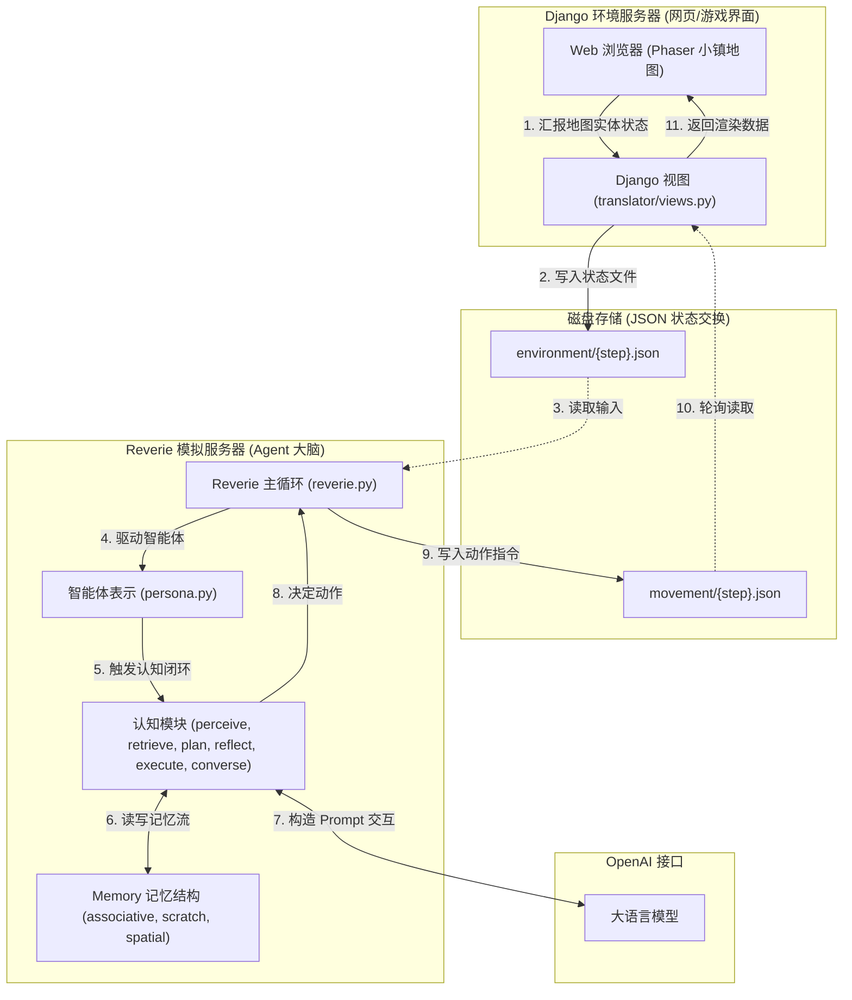

# Generative Agents 项目代码结构与认知机制分析报告

本报告系统分析了 [Generative Agents](https://arxiv.org/abs/2304.03442) 本地克隆仓库的代码结构、桥接通信机制、智能体核心属性设计，以及“记忆-反思-规划”认知循环与社交涌现的验证手段。

---

## 1. 核心架构与数据流

整个系统由**前端小镇渲染服务器 (Django + Phaser)** 和 **后端智能体模拟服务器 (Reverie)** 两大部分构成。它们并不通过数据库直连进行强实时同步，而是通过读写 `storage/` 目录下的 JSON 状态交换文件来进行异步时间步对齐（类似于乒乓交替机制）。

---

## 2. 详细项目目录结构

### 📁 `reverie/` (后端智能体模拟服务器)
负责运行智能体（Generative Agents）的核心大脑，处理时间推移、记忆索引、规划和交互逻辑。
*   [reverie.py](file:///g:/generative_agents/reverie/backend_server/reverie.py)：主入口文件。定义了 `ReverieServer` 类，维护全局时钟与动作循环，提供命令行控制台供用户下达 `run`、`save` 等指令。
*   `backend_server/`
    *   [maze.py](file:///g:/generative_agents/reverie/backend_server/maze.py)：小镇二维网格地图表示，记录障碍物碰撞块、房间扇区以及各种家具物品的位置状态。
    *   [path_finder.py](file:///g:/generative_agents/reverie/backend_server/path_finder.py)：基于 A* 算法的路径规划模块，负责将 Agent 的移动目标转化为具体的网格坐标路径。
    *   `persona/` (Agent 单体架构)
        *   [persona.py](file:///g:/generative_agents/reverie/backend_server/persona/persona.py)：定义 `Persona` 类，它聚合了以下认知模块与记忆结构。
        *   `cognitive_modules/` (核心认知阶段)：
            *   [perceive.py](file:///g:/generative_agents/reverie/backend_server/persona/cognitive_modules/perceive.py)：**感知**。扫描智能体视野范围内的事件及物品状态。
            *   [retrieve.py](file:///g:/generative_agents/reverie/backend_server/persona/cognitive_modules/retrieve.py)：**检索**。根据新感知到的事件，从记忆流中计算“相关性”、“新近度”和“重要性”，提取出匹配的上下文。
            *   [plan.py](file:///g:/generative_agents/reverie/backend_server/persona/cognitive_modules/plan.py)：**规划**。生成一天的日程计划，并随着时间流逝将其逐步细化。
            *   [reflect.py](file:///g:/generative_agents/reverie/backend_server/persona/cognitive_modules/reflect.py)：**反思**。定期触发，总结记忆流中的零散节点，生成高层次的客观想法（Insights）。
            *   [converse.py](file:///g:/generative_agents/reverie/backend_server/persona/cognitive_modules/converse.py)：**对话**。当智能体相遇时，驱动生成对话文本和决定是否停止谈话。
            *   [execute.py](file:///g:/generative_agents/reverie/backend_server/persona/cognitive_modules/execute.py)：**执行**。将高层决策翻译为小镇网格坐标和家具操作状态。
        *   `memory_structures/` (三层记忆模型)：
            *   [associative_memory.py](file:///g:/generative_agents/reverie/backend_server/persona/memory_structures/associative_memory.py)：**关联记忆库**。Agent 的核心“记忆流”，以节点（Node）形式存储事件、想法和聊天记录。
            *   [scratch.py](file:///g:/generative_agents/reverie/backend_server/persona/memory_structures/scratch.py)：**工作记忆区**。存放非永久的临时变量，如 Agent 姓名、当前位置、当日详细计划、正在执行的动作等。
            *   [spatial_memory.py](file:///g:/generative_agents/reverie/backend_server/persona/memory_structures/spatial_memory.py)：**空间记忆树**。Agent 脑海中的虚拟地图，记录其认知范围内的“世界-区域-场所-物品”层级结构。
        *   `prompt_template/`：
            *   [run_gpt_prompt.py](file:///g:/generative_agents/reverie/backend_server/persona/prompt_template/run_gpt_prompt.py)：包含构造反思、规划、对话等复杂场景的 Prompt 模版。
            *   [gpt_structure.py](file:///g:/generative_agents/reverie/backend_server/persona/prompt_template/gpt_structure.py)：调用 OpenAI 接口的基础类，包含防止超时的重试逻辑及返回 JSON 解析。

### 📁 `environment/` (前端小镇环境服务器)
基于 Django 搭建，前端游戏界面采用 Phaser 开发，用于渲染小镇地图、人物运动动画及显示气泡框。
*   `frontend_server/`
    *   [manage.py](file:///g:/generative_agents/environment/frontend_server/manage.py)：Django 标准启动入口。
    *   [views.py](file:///g:/generative_agents/environment/frontend_server/translator/views.py)：负责处理前后端核心接口，例如：
        *   `process_environment`：接收前端发送的第 N 步环境状态，写入 `storage/{sim_code}/environment/N.json`。
        *   `update_environment`：当后端计算完第 N 步动作并输出 `movement/N.json` 后，此接口将其返回给前端进行人物移动渲染。
    *   `static_dirs/assets/`：存放基础的模拟地图（Smallville）和预设的 Agent 历史剧本（如 `agent_history_init_n25.csv`）。
    *   `storage/`：模拟状态的持久化存档目录，里面按仿真名存放每个时间步下的 `environment/*.json` 和 `movement/*.json` 历史快照。

---

## 3. 智能体核心属性与动作机制分析

### 3.1 核心属性（无需生理数值，完全文本驱动）
代码中**没有**设定任何像“饱食度（satiety/hunger）”、“体力（stamina/energy）”或“疲劳值”之类的数值性生理状态指标。
*   智能体的状态属性主要保存在 [Scratch](file:///g:/generative_agents/reverie/backend_server/persona/memory_structures/scratch.py#L14) 类中。
*   它使用的核心属性被称为 **ISS（Identity Stable Set，身份稳定集）**，全都是由**自然语言描述**构成的（参见 [get_str_iss](file:///g:/generative_agents/reverie/backend_server/persona/memory_structures/scratch.py#L382-L414)），例如：
    *   `self.innate`：先天特质（如 `"hard-edged, independent, loyal"`）。
    *   `self.learned`：后天特质（如 `"Isabella is a cafe owner who loves to host people..."`）。
    *   `self.currently`：当前的核心焦点（如 `"Isabella is organizing a Valentine's Day party at her cafe..."`）。
    *   `self.lifestyle`：生活习惯习惯描述（如 `"Isabella goes to bed around 11pm, sleeps for 7 hours..."`）。
*   **行为驱动机制**：智能体之所以会去“睡觉”或“吃饭”，并不是因为检测到某个数值低了，而是因为在日计划生成时，大语言模型（LLM）读取了上述的 `lifestyle` 等自然语言上下文，从而在规划中编排了 `sleeping` 或 `eating breakfast` 等行程。

### 3.2 原子动作（无硬编码动作，空间三元组事件映射）
代码中**没有**硬编码诸如 `EAT()`、`SLEEP()` 或 `TALK()` 这样的原子指令代码。
*   动作在逻辑上表现为由大语言模型生成的**自然语言文本**（`self.act_description`），例如 `"editing her novel"`。
*   [execute.py](file:///g:/generative_agents/reverie/backend_server/persona/cognitive_modules/execute.py) 会将动作描述解析为地图上的空间目标地址路径 `act_address`（如 `world:sector:arena:object`），再通过 [path_finder.py](file:///g:/generative_agents/reverie/backend_server/path_finder.py) 中的 A* 寻路算法转化为在 Phaser 2D 坐标网格中一步步移动的具体坐标。
*   当智能体移动到特定的物体（如 `desk`）时，系统会调用 [generate_action_event_triple](file:///g:/generative_agents/reverie/backend_server/persona/cognitive_modules/reflect.py#L58-L70)，利用 GPT 将其翻译为环境交互的**事件三元组**（例如 `(Isabella Rodriguez, use, desk)`）及对应的 Emoji，通知小镇的物理地图做出状态响应。

---

## 4. “记忆-反思-规划”认知循环与社交涌现的验证机制

项目中设计了两种主要的验证手段，以方便研究者观测和评估这一认知回路与社交涌现现象：

### 4.1 控制台交互验证（后端）
在后端控制台 [reverie.py](file:///g:/generative_agents/reverie/backend_server/reverie.py#L415) 的主循环中，系统提供了命令行查询工具，可暂停游戏并查询指定 Persona 的实时思维状态：
1.  **验证规划 (Plan)**：
    *   `print persona schedule <name>`：打印该 Agent 详细的当日分解日程表。
    *   `print all persona schedule`：打印所有 Agent 的日程摘要。
2.  **验证记忆与反思 (Memory & Reflection)**：
    *   `print persona associative memory (event) <name>`：查看关联记忆流中的所有客观事件。
    *   `print persona associative memory (thought) <name>`：查看 Agent 从零散事件中反思提取的高阶 Insight（想法）。
    *   `print persona associative memory (chat) <name>`：查看与其他 Agent 的对话记录记忆。
3.  **验证社交与访谈**：
    *   `call -- analysis <name>`：启动无副作用的对话会话。用户可以像“面试/心里评估”一样直接向 Agent 提问，观察其是否能依据其已有记忆库和设定进行合理且符合人设的问答。

### 4.2 网页状态可视化验证（前端）
Django 的 [views.py](file:///g:/generative_agents/environment/frontend_server/translator/views.py#L186-L232) 实现了 `replay_persona_state` 路由。
当用户在浏览器中访问 `/replay_persona_state/<sim_code>/<step>/<persona_name>` 时，前端会渲染一个专属面板，直观可视化地列出：
1.  **Scratch 状态**：包含 Agent 当前的时间、坐标、当前动作及物体交互信息。
2.  **Spatial Memory 树结构**：显示 Agent 对小镇物理结构的认知深度。
3.  **分类记忆节点列表**：以时间流的形式清晰展示该智能体积累的 **Events（感知到的事件）**、**Thoughts（反思生成的想法）** 和 **Chats（社交对话）**，从而可以直接追踪和检验社交涌现（如情人节派对传言是如何通过多次对话在小镇中传播的）。
