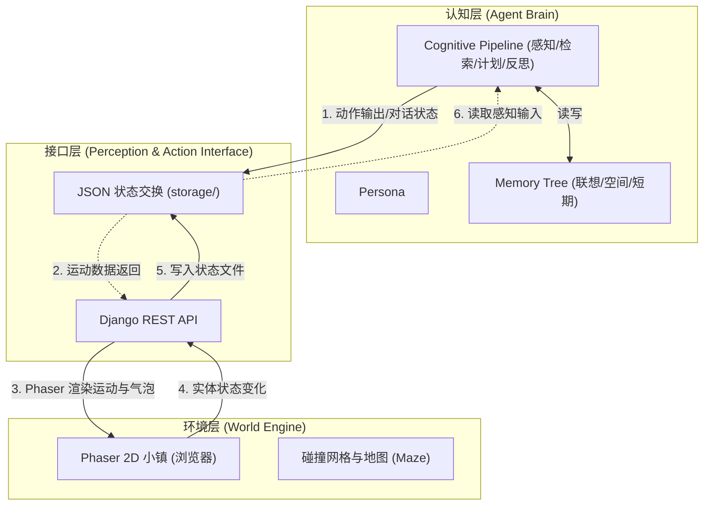

# Agent 认知与执行流水线架构指南

本文档系统介绍了 Generative Agents 项目的核心技术架构设计、认知大脑、生理与心理动机系统、双系统决策管线，以及智能体从感知、决策、编译到底层技能（Skill）执行的具体生命周期。

---

## 💡 架构设计三大铁律 (Three Golden Rules)

在对本项目进行任何认知管线重构、代谢数值调整、或行为拦截器设计时，必须严格遵守以下三大铁律，使智能体拥有“随机应变”的生命力，而非僵硬的固定演出：

1. **铁律 1：认知大脑（LLM）负责“随机应变”**  
   智能体不应遵循死板的预设行为脚本。系统在每一步将足够的环境状态、生理数值及记忆上下文组装并提供给大模型，由大模型这个“认知大脑”给出具体方案与行动（自主决策）。
2. **铁律 2：硬编码仅负责“物理底座”**  
   代码应当且仅应当用于构建底层世界的“客观规律”（如代谢值衰减、生命值扣减、物理碰撞与阻挡等约束），作为不可逾越的物理和生理规则。
3. **铁律 3：消除行为与社交逻辑的硬编码（去特化）**  
   一切属于社会学或人际交互的行为逻辑（例如：进食前必须等待服务员端咖啡、主动找某人对话等），决不能通过死板的逻辑代码硬编码写死，而应通过底层物理事件或属性改变，由大模型大脑自主决定行动方案。

---

## 1. 系统三层架构

整个项目架构在逻辑上划分为清晰的三层结构，实现了“大脑计算”、“网络通信”与“环境渲染”的解耦：



### 1.1 认知层 (Cognitive Layer)
认知层是智能体的“大脑”（Agent Brain），独立运行于后端 `reverie/` 容器中。
* **职责**：维护智能体的身份特质（ISS）、记忆库与思维流水线。在每个 step 循环中，并发调用认知管线，产生下一个动作。
* **核心类**：`Persona` 整合了联想记忆库（`AssociativeMemory`）、空间记忆树（`MemoryTree`）以及短期工作区（`Scratch`）。

### 1.2 接口层 (Perception & Action Interface)
接口层是连接大脑与环境的桥梁（API），由 Django 构建。
* **职责**：前后端通过异步读写 `storage/` 目录下的 JSON 状态交换文件来进行数据对齐。
* **输入感知**：前端将小镇当前的实体状态与用户输入（聊天、指令）以 JSON 文件形式写入 `environment/{step}.json`，后端读取进行感知。
* **行动输出**：后端计算完毕后，将行动路径与气泡对话写入 `movement/{step}.json`，前端轮询该接口获取并渲染。

### 1.3 环境层 (Environment Layer)
环境层是物理世界引擎（World Engine），由前端 Phaser 游戏框架与后端 `Maze` 类共同定义。
* **职责**：处理小镇网格坐标、碰撞检测（障碍物物理屏障）和环境家具状态变化。
* **核心类**：`Maze` 维护了 2D 瓦片地图上的碰撞矩阵（`collision_maze`）、区域映射（`address_tiles`）以及挂载在各瓦片上的环境事件集（`events`）。

---

## 2. 记忆流与反思机制

智能体的社会涌现性源自“记忆-反思-规划”的三元认知循环：

### 2.1 记忆流 (Memory Stream)
智能体拥有三层记忆模型：
1. **空间记忆 (Spatial Memory)**：三层级树状字典，记录其认知范围内的“World → Sector → Arena → Game Object”层级结构，用于空间定位。
2. **联想记忆 (Associative Memory)**：以 `ConceptNode` 节点形式存储事件、想法与对话。
3. **临时工作记忆 (Scratch)**：存储实时生理指标（饱食度、精力、健康度）、已规划路径、当前正在执行的动作等。

#### 记忆检索算法 (`new_retrieve()`)
当智能体需要决策或对话时，系统使用该算法从记忆流中检索最相关的 $N$ 个记忆节点。检索评分基于三个维度的加权求和：
$$\text{Score} = w_{\text{recency}} \times \text{Recency} + w_{\text{relevance}} \times \text{Relevance} + w_{\text{importance}} \times \text{Importance}$$

*   **时近性 (Recency)**：指数衰减函数 $\lambda^{\Delta t}$ ($\lambda=0.995$)，越近发生的事情得分越高。
*   **相关性 (Relevance)**：计算检索焦点文本与记忆节点描述的**余弦相似度**。
*   **重要性 (Importance)**：LLM 评分机制（1-10），越关键的记忆得分越高。

### 2.2 反思机制 (Reflection Mechanism)
反思机制定期运行。每感知一个新事件，反思计数器会扣减该事件的重要度：
$$\text{importance\_trigger\_curr} \gets \text{importance\_trigger\_curr} - \text{poignancy}$$
当计数器值 $\le 0$ 时触发反思（默认阈值为 150）。

#### 执行步骤
1. **生成焦点**：LLM 根据最近的 100 条事件记忆，提出 3 个最能反映当前核心状态的问题（焦点）。
2. **检索关联**：利用 `new_retrieve()` 为这 3 个焦点检索相关的历史记忆。
3. **产生洞察**：LLM 提炼记忆，产生 5 个具有普适性的客观想法（Insights），并链接到作为证据的节点 ID。
4. **归档想法**：将这些 Thoughts 作为新的记忆节点存回联想记忆库，并计算嵌入向量以供后续检索。

#### 附属调用优化 (Cost Reduction)
*   **反思去重**：对话完成后，系统会记录当前会话的唯一聊天指纹 `chat_reflection_completed_fingerprint`。当反思模块检测到该聊天指纹已被处理时，会跳过重复的反思计算。这配合对话轮次限制（详见第6节）及事实型元数据确定性生成，在双人对话场景下最多可减少约 20 次附属 LLM 调用。

---

## 3. 生理稳态与心理动机系统

智能体的决策行为自下而上受生理指标驱动，自上而下受层级化的心理动机指引。

### 3.1 生理指标（Core State Drives）
底层物理世界在每一步模拟循环（step）中均执行生理代谢扣减：
*   **饱腹度 (Satiety)**：初始值 60.0。每步自然衰减 $-0.08$（睡眠时衰减 $-0.04$）。
*   **精力 (Stamina)**：初始值 75.0。每步自然衰减 $-0.04$（移动寻路时为 $-0.07$），睡眠时每步恢复 $+0.15$，静止休息时每步恢复 $+0.08$。
*   **情绪 (Mood)**：初始值 60.0。自然状态下每步衰减 $-0.06$，在社交状态下每步恢复 $+0.30$。
*   **健康度 (Health)**：初始值 85.0。当 `Satiety` 或 `Stamina` 归 $0$ 时，健康度将分别遭受每步 $-0.05$ 或 $-0.02$ 的持续受损。当健康度小于等于 0 时，智能体冻结（死亡）。

### 3.2 心理动机（Psychological Motives）与压力选择算法
除了生理需求外，系统拓展了 10 个维度的心理和生理动机。动机选择采用基于安全线偏差、危机线偏差及权重参数的**压力值（Pressure Score）**算法：

| 动机维度 (Motive) | 物理映射对象 | 初始值 | 安全阈值 | 危机阈值 | 衰减率 | 权重 (Priority Weight) |
| :--- | :--- | :---: | :---: | :---: | :---: | :---: |
| **satiety** | `satiety` | 60.0 | 50.0 | 25.0 | 0.08 | 1.00 |
| **stamina** | `stamina` | 75.0 | 45.0 | 20.0 | 0.04 | 1.00 |
| **health** | `health` | 85.0 | 55.0 | 25.0 | 0.00 | 1.20 |
| **safety** | - | 65.0 | 45.0 | 20.0 | 0.01 | 1.05 |
| **mood** | `mood` | 60.0 | 50.0 | 30.0 | 0.03 | 1.00 |
| **belonging** | - | 58.0 | 45.0 | 25.0 | 0.02 | 0.95 |
| **status** | - | 55.0 | 42.0 | 24.0 | 0.01 | 0.90 |
| **autonomy** | - | 62.0 | 45.0 | 25.0 | 0.01 | 0.90 |
| **competence** | - | 60.0 | 46.0 | 28.0 | 0.015| 0.92 |
| **meaning** | - | 58.0 | 44.0 | 26.0 | 0.01 | 0.88 |

#### 压力得分公式
在 `motive_selector.py` 的 `_compute_pressure` 中，每个动机计算三个偏差占比：
*   **基线偏差**：$baseline\_gap = \max(0.0, \frac{initial - current}{initial})$
*   **安全偏差**：$safe\_gap = \max(0.0, \frac{safe - current}{safe})$
*   **危机偏差**：$critical\_gap = \max(0.0, \frac{critical - current}{critical})$

$$\text{pressure\_score} = baseline\_gap \times 0.35 + safe\_gap \times 0.95 + critical\_gap \times 1.8 + \max(0.0, priority\_weight - 1.0) \times 0.25 + decay\_per\_step \times 2.5 + \text{urgency\_bonus}$$
*   **Urgency Bonus (危机加成)**：
    *   $current \le critical \implies \text{urgency\_bonus} = +1.2$
    *   $current \le safe \implies \text{urgency\_bonus} = +0.35$
    *   否则无额外加成。

#### 主次动机生成机制
1. **主动机 (Dominant Motive)**：选出压力值最高的动机。
2. **次动机 (Secondary Motive)**：仅在第二排名的动机处于危机、警戒状态或其压力得分不低于主动机得分 $60\%$ 且不小于 0.35 时启用，否则为空。
3. **警戒动机 (Guard Motive)**：将当前任意处于 `critical` 阶段的生理或心理状况作为警戒状态。
4. **自然语言拼装**：将主动机、次要动机拼接成大模型理解的中文长句注入 prompt 作为输入。

---

## 4. 双系统决策管线与执行生命周期

为了取得 Token 开销和响应延迟的平衡，系统采用快思考与慢思考结合的双系统：

### 4.1 快思考：快速路径机制 (Fast Path)
如果智能体处于**正在移动中（`planned_path` 非空）**、非新的一天且无生理危机，系统直接跳过完整的慢思考认知管线，仅调用 `execute()` 步进下一格坐标。行走状态下的 LLM 调用次数降低为 **0**。

### 4.2 慢思考：全量决策流程 (Full Cognitive Pipeline)
在动作结束、执行失败或面临生理危机时，触发慢思考，默认配置下使用 **Joint LLM 联合决策管线**：

```text
1. 收集状态 rules 与 local 上下文 (motive, backpack, environmental, invalid targets)
2. 调用 run_gpt_prompt_joint_decision() 发起单次 LLM 请求
3. 同时输出 thought 与结构化动作 action JSON
4. 本地清洗与校验 (修正别名、拼写变种与时长边界)
5. 编译为运行时 compiled_skill_id
6. 执行前语义纠错并解析 target 为具体物理坐标 tile 
7. 写入 scratch 工作记忆并利用 A* 寻路生成 planned_path
```

> [!NOTE]
> 仅在环境变量 `ENABLE_JOINT_DECISION_PIPELINE` 显式设为 `0` 时，系统才会回退到 legacy 两阶段 LLM 决策方式（即先调用 `demand_thinking` 提示词生成想法，再调用 `action_translation` 翻译为动作 JSON）。

#### 本地清洗别名映射
Joint 决策输出的 `mode` 与 `duration` 会自动由 `structured_action_intent.py` 中的本地逻辑清洗纠正，不占用大模型调用次数：
*   `chat` / `chat with` $\rightarrow$ `conversation`
*   `leisure use` $\rightarrow$ `solo_leisure`
*   `request resource` / `ask for help` $\rightarrow$ `request`

#### 运行时 Skill 编译映射
通过 `compile_action_intent()` 最终编译出稳定的运行时 `compiled_skill_id`：
*   `Socialize + persona` $\rightarrow$ `seek_and_chat`
*   `Socialize + venue` $\rightarrow$ `hangout_social_venue`
*   `Recreate + social_venue` $\rightarrow$ `hangout_social_venue`
*   `Recreate + solo_leisure` $\rightarrow$ `leisure_use`
*   `Recreate + wander` $\rightarrow$ `wander`
*   `Recreate + daydream` $\rightarrow$ `daydream`
*   其他动作用 `normalize_skill_id()` 进行别名归一化（如 `eat` / `drink` $\rightarrow$ `consume`；`get` / `retrieve` $\rightarrow$ `gather`）。

#### 物理目标解析与语义纠错
*   **物理目标补全**：如果 Consume 缺少具体目标且背包里有食物，本地自动补全；缺少 Rest 目标时自动寻找床或沙发。当背包为空时，`Consume + 食物资源` 自动纠正为 `Gather`。
*   **确定性食物来源列表**：如果采集食物，本地会检查并纠正到具体的冰箱（`refrigerator`）、炉灶（`stove`）、咖啡厅柜台（`cafe counter`）或苹果树（`apple tree`）物理实例。
*   **坐标转换**：将解析出的目标转换为 `world:sector:arena:object` 地图网格 tile 地址。

#### 4.3 LLM 决策自主纠错链 (LLM Decision Correction Loop)
沙盒中的 NPC 可能会生成物理上不可执行的动作（如背包为空时 Consume 食物、向空背包 NPC 请求物品等）。系统建立了**只读校验与自主纠错闭环**：
1.  **物理约束只读校验**：在执行前由 `decision_constraints.py` 检查决策可行性。校验器**仅提供客观失败证据**（如 `inventory_missing`、`self_target_forbidden`），绝不自动替换目标或静默改写动作，以保留对模型纠错能力的测试。
2.  **纠错反馈注入 (DecisionGuidance)**：如果校验失败，生成的 `VALIDATION_FEEDBACK` 失败证据会被作为 `DecisionGuidance` 写入下一次决策的决策胶囊（Decision Capsule）中。这会改变 prompt 的内容和 SHA-256 哈希，促使 LLM 在重试时感知并修正错误。
3.  **重试预算与安全 Fallback**：系统允许进行最多由 `LLM_CORRECTION_MAX_RETRIES` 定义的重试次数（默认为 0～3 次）。仅在重试预算完全耗尽后，系统才会使用带有 `correction_fallback` 证据的短时安全 `Idle` 动作，防止执行层崩溃或死锁。预算耗尽的日志将在 trace 合并后统一写入一次。

#### 4.4 结构化动作记忆映射 (Structured Action Event Memory Mapping)
为了防止在动作执行与记忆写入时产生不一致（例如动作已归一为 `gather`，但写入记忆的事件三元组却翻译为 `is / idle`），系统优化了语义投影机制：
*   **确定性动作事件生成**：经校验和归一化后的标准动作（如 `gather`、`consume`、`leisure_use`），会直接本地映射为确定性结构 `(persona.name, normalized_skill_id, normalized_target)`。例如 Klaus Mueller 采集苹果直接投影为 `("Klaus Mueller", "gather", "apple tree")`，不再调用第二个 LLM 猜测三元组。
*   **兼容路径**：对于无法匹配归一化规则的旧式动作，仍保留调用 LLM 进行翻译的兼容回退路径。

#### 4.5 同一步内新鲜显式决策保护 (Same-Step Fresh Decision Protection)
在模拟中，NPC 刚刚做出的显式决策可能会在同一步内被随后触发的自动社交反应（如 `missing_schedule` 引起的社交响应）所覆盖，导致决策失效和逻辑矛盾。
*   **显式决策守卫**：`plan.py` 引入 `_has_fresh_explicit_decision()` 保护机制。若 NPC 在当前模拟步内已经成功生成并翻译了显式决策动作，则在此步内拦截并延迟所有针对该角色的自动社交反应。
*   **延迟记录**：被延迟的社交反应会被记录为 `social_reaction_deferred` 日志（原因为 `fresh_explicit_decision`），并在后续步骤重新评估。

#### 4.6 提示词与上下文等价压缩 (Context & Prompt Compression)
为优化全量推理耗时（避免提示词字数过长，P90 曾达 19.37 秒），系统在 `run_gpt_prompt.py` 和 `plan.py` 中实施了等价去重与压缩：
*   **已观察资源上下文压缩**：按标准化资源名聚合同类资源，合并其库存与可供性事实，同类资源只保留单个代表性地址；仅保留与资源匹配的具体事件；不设资源条数上限（不进行过滤，保留所有资源类型以供纠错校验测试）。
*   **世界资源静态说明压缩**：去除重复的自然模板，改用緊凑结构（例如 `apple tree[satiety]: 可获取食物`）。
*   **社会事件去重**：同一社会事件即使挂载在多个对象上，也仅在上下文中保留一次。

#### 4.7 决策输出契约与约束 (Prompts Constraints & Contracts)
在完整决策和纠错提示词中，注入了强权威约束以规范模型输出：
*   **自指目标禁用**：明确告知模型当前行动者姓名，注入 `self_target_forbidden=true` 状态，禁止行动者将自己作为动作对象（防止出现自己找自己聊天的错误）。
*   **长期策略字段契约**：要求必须在输出的 JSON 中完整表达 `strategic_intent`、`expected_followup` 和 `risk`。
*   **校验规则**：`risk` 必须始终非空；非危急生理动机下，`strategic_intent` 和 `expected_followup` 必须非空（饥饿、疲劳等紧急生存危机时允许后续计划为空）。

---

## 5. 可插拔技能包规范 (Skill Packs)

系统的物理执行层 `execute.py` 仅作为物理格点步进器，不编写业务动作逻辑。所有的客观条件校验、数值结算后果均内聚在可插拔的技能包（Skill Pack）中。

### 5.1 技能基类定义 (`BaseSkillPack`)
所有具体技能都继承自 `BaseSkillPack` 并实现以下三个主要接口：
*   `can_execute(persona, target, maze) -> bool`：【客观前置校验】检查执行前置（如背包是否有食物、目标是否存在）。不满足时返回 `False`，防止因状态异常死锁。
*   `cognitive_decision(persona, target, maze, personas) -> dict`：【微认知调用（可选）】在到达后进行微观决策（如具体要做哪道菜）。
*   `on_arrive(persona, target, maze, personas)`：【物理后果结算】到达后执行。触发代谢数值提升、属性变动、库存变动、回写社会事件状态等。

### 5.2 核心技能包列表
*   `gather` (采集)：从指定资源点获得苹果或物品，并增加采集 XP。
*   `consume` (进食/消费)：消耗背包对应物品，提升饱腹度 `+40` 及健康 `+5`。
*   `rest` (休息)：精力值在睡眠状态下每步恢复 `+0.15`，静支休息恢复 `+0.08`。
*   `seek_and_chat` (社交寻找对话)：寻人并发起会话。
*   `hangout_social_venue` (场所社交)：在Rose & Crown等场所进行公共社交。
*   `request` (资源请求)：向其他 NPC 请求给予物品或帮助。

---

## 6. 对话与社交系统 (Chat System)

### 6.1 延迟执行哲学 (Lazy Execution)
当一个智能体想要找另一个人聊天时，系统使用延迟会话创建策略：
1. 发起方在决策阶段通过 LLM 确认意图后，先将自身动作置为 `chat with <target>`，本地校验通过后，同时将接收方下一个 10 分钟的日程改写为 `chat with <initiator>`（强制插入占位）。
2. 在两个小人没有物理到达同一 tile 之前，**不调用任何 LLM生成对话内容**。
3. 双方在物理上相遇且均到达目的地后，才正式开启 `convo_session` 并调用对话生成模型，从而避免了“未到场却已聊完”的时空错乱。

### 6.2 社交会话生命周期
```text
[物理靠近阶段] 
  双方行走 -> 弹空 planned_path
[到达判定阶段] 
  触发 on_arrive -> 进入 SKILL_REGISTRY["chat with"] / chat_skill.py
[会话创建阶段] 
  调用 open_convo_session()
  -> 验证双方是否在同一 arena 且未在其他会话中
  -> 初始化 convo_session，设置 survival_applied = True (单次到达只结算一次)
[对话轮次循环] 
  第一轮 LLM 提示词生成 -> 生成气泡 -> 写入 movement 数据包
  -> 双方接收反馈 -> 迭代轮次 (最多 6 轮)
[会话结束阶段] 
  对话正常结束/被饥饿疲劳危机打断
  -> 触发 close_convo_session()
  -> 提取对话摘要存入各自联想记忆 (poignancy 评分)
  -> 释放双方角色状态，清空动作与 planned_path
```

#### 6.3 对话成本与反思优化
为了控制多 NPC 对话时的 LLM 附属调用成本：
1.  **限制最大轮数**：对话的最大上限从 8 轮减少至 6 轮。
2.  **确定性元数据生成**：对话结束后，记忆事件的主谓宾、谓词、重要性等事实型元数据，不再通过 LLM 解析，而是通过规则在本地确定性生成（减少约 8 次 LLM 调用）。
3.  **反思指纹去重**：对话完成后记录 `chat_reflection_completed_fingerprint` 指纹，反思模块对已处理的指纹直接跳过，避免重复反思（减少约 12 次调用）。

---

## 7. 关键调试日志

排查整个全量决策与执行链路时，优先按顺序对照检查以下运行日志：

| 日志文件 | 主要排查内容 |
| :--- | :--- |
| `logs/step_timing.jsonl` | 区分当前 step 运行的是 `full_pipeline` 还是 `fast_path`，并查看各阶段耗时。 |
| `logs/llm_request_events.jsonl` | 查看 LLM 原始响应、校验结果、缓存命中状态和请求耗时。 |
| `logs/decision_prompt_trace.jsonl` | 查看最终注入的动机长句、警告规则及 Joint 决策的 thought 细节。 |
| `logs/translation_verify.jsonl` | 查看动作编译结果、模式映射以及本地纠错（如 Consume 转 Gather）的决策过程。 |
| `logs/action_execution_debug.jsonl` | 查看寻路生成、到达状态、运行时 Skill 寻址以及 precheck (`can_execute`) 的校验结果。 |
| `logs/action_outcome.jsonl` | 查看具体 Skill 落地执行后的 `on_arrive` 结算，包括生理/心理数值升降和属性变化。 |
| `logs/decision_stability.jsonl` | 查看动作切换状态、打断挂起（如 physiological_crisis 挂起）与恢复链路。 |
| `logs/decision_constraint_hits.jsonl` | 记录物理约束校验被触发的详细动作、位置状态以及具体失败原因。 |
| `logs/decision_correction_trace.jsonl` | 记录每一次 LLM 纠错重试的详细 trace（输入动作、错误反馈、第几次 retry 尝试等）。 |

#### 7.1 反思分数与焦点校验优化
为了防止反思机制被误判格式而高频回退至 safe-fallback：
*   **Poignancy 分数校验**：`event_poignancy` / `thought_poignancy` / `chat_poignancy` 的分数接受中央包装器解析后的整数、浮点数或包含数字的字符串，并自动验证数值在 1～10 范围内。
*   **Focal Point 列表校验**：`focal_pt` 接受中央解析后的 List 列表，或 List 格式的字符串，排除了由于额外 JSON 封装或空列表引起的误判。

