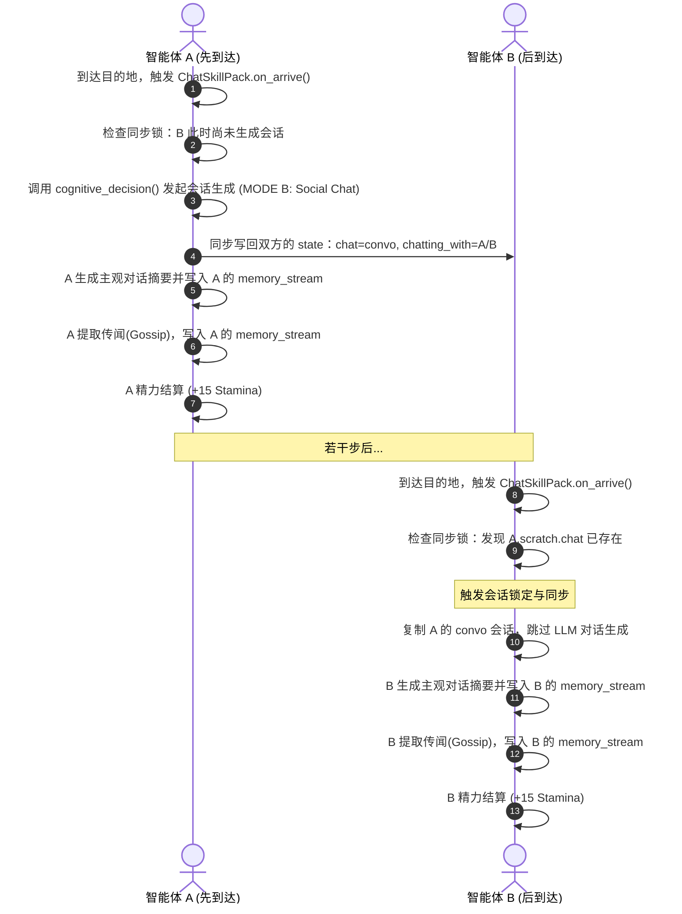

# Generative Agents — 认知决策、技能包与社交对话系统设计说明书

本文档系统阐述了项目物理执行层与认知层解耦的底层哲学、双系统认知架构、"自然语言到物理动作"的两阶段翻译管线、可插拔技能包规范、社会关系图谱设计，以及完整的对话与社交系统（Chat System）生命周期。

---

## 目录
1. [核心设计哲学与双系统架构](#1-核心设计哲学与双系统架构)
   - [1.1 全要素虚拟现实哲学](#11-全要素虚拟现实哲学)
   - [1.2 双系统认知设计 (快思考与慢思考)](#12-双系统认知设计-快思考与慢思考)
   - [1.3 行为与社交"去特化"与死锁防范](#13-行为与社交去特化与死锁防范)
2. [自然语言到技能执行管线 (Pipeline)](#2-自然语言到技能执行管线-pipeline)
   - [2.1 整体分层架构](#21-整体分层架构)
   - [2.2 两阶段认知与结构化动作 (LLM 决策)](#22-两阶段认知与结构化动作-llm-决策)
   - [2.3 动作归一化与命令协议 (Command Protocol)](#23-动作归一化与命令协议-command-protocol)
   - [2.4 目标地址解析与 Scratch 写入](#24-目标地址解析与-scratch-写入)
3. [可插拔技能包架构 (Skill Packs)](#3-可插拔技能包架构-skill-packs)
   - [3.1 设计哲学与物理底座化](#31-设计哲学与物理底座化)
   - [3.2 技能包基类与接口规范](#32-技能包基类与接口规范)
   - [3.3 执行层调度器设计 (execute.py)](#33-执行层调度器设计-executepy)
   - [3.4 核心技能包实现列表与映射表](#34-核心技能包实现列表与映射表)
4. [对话与社交系统 (Chat System)](#4-对话与社交系统-chat-system)
   - [4.1 延迟执行设计哲学 (Lazy Execution)](#41-延迟执行设计哲学-lazy-execution)
   - [4.2 对话生命周期与时序流程](#42-对话生命周期与时序流程)
   - [4.3 NPC 社交对话核心机制](#43-npc-社交对话核心机制)
   - [4.4 与造物主 (Creator) 聊天的特权模式](#44-与造物主-creator-聊天的特权模式)
   - [4.5 对话物理存储与记忆契约](#45-对话物理存储与记忆契约)
   - [4.6 社交系统约束与后续优化建议](#46-社交系统约束与后续优化建议)
5. [社会关系图谱与语义检索](#5-社会关系图谱与语义检索)
   - [5.1 关系图谱结构](#51-关系图谱结构)
   - [5.2 关系读写 API 与数据保存](#52-关系读写-api-与数据保存)
6. [系统调试与问题排查入口](#6-系统调试与问题排查入口)

---

## 1. 核心设计哲学与双系统架构

### 1.1 全要素虚拟现实哲学
本系统本质上是一个**模拟全要素的虚拟现实世界 (Full-Element Virtual Reality Simulator)**。在这一设计哲学下，系统各层次的职责被严格划分：
1. **信息聚合（Perception / Sensor）**：系统底层负责实时监测和整理小镇的"全要素信息"（包括物理空间网格、物品交互状态、角色生理特征如饱食度等、联想/空间记忆，以及当前时刻、星期、绝对时间及动作所剩时长等时间要素），并将这些全要素数据组装成自然语言提示词（Prompt）。
2. **认知计算（LLM Brain）**：系统本身不具备硬编码的社会学意识或社交潜规则。所有的行为动机、协作方案、社交应答、求生抉择，均由大模型（LLM）作为"大脑"在接收到提示词后，结合当前时间上下文与时限要求，自主进行逻辑推演并输出行动决策应答（铁律 1）。
3. **客观规律维护（World Physics Constraints & Time Decay）**：系统代码的硬编码职责应当且仅应当作为客观物理底座，去维护这个虚拟世界的客观物理与时间规律（例如：A* 寻路与碰撞阻挡、以时间/步数为驱动的饱食度与精力值代谢衰减、生命值扣减、库存资源加减等）（铁律 2）。
4. **物理执行（Execution / World Engine）**：系统在获取大模型的决策响应后，由底层引擎控制智能体执行对应动作（如寻路、物品扣减、坐标移动）。

### 1.2 双系统认知设计 (快思考与慢思考)
为了防止大模型在日常琐碎行为中造成不必要的 Token 消耗与推理延迟，我们将智能体的决策解耦为双系统：
*   **系统 1 (快思考 / 物理底座)**：智能体的高频生理代谢动作（如"睡觉/休息"恢复精力，或"吃苹果"恢复饱食度）。一旦大模型在外层规划了此项动作且处于寻路和行走中时，物理底座代码通过 **快速路径（Fast Path）** 跳过机制直接推进，并在 `on_arrive` 结算处修改角色属性，**实现零大模型开销**。
*   **系统 2 (慢思考 / 技能认知)**：只有当日常计划结束需要重决策、突发生存危机，或者需要主观变数的行为（如"选择食谱烹饪"、"多轮社交对话"）时，才会触发完整的认知循环，调用 LLM 大脑。

### 1.3 行为与社交"去特化"与死锁防范
根据**铁律 3（消除行为与社交逻辑的硬编码 / 去特化）**，一切属于社会学或人际交互的行为逻辑（例如：进食前必须等待服务员端咖啡、主动找某人对话等），决不能通过死板的逻辑代码硬编码写死，而应通过底层物理事件或属性改变，由大模型大脑自主决定行动方案。

#### 案例分析：咖啡馆服务死锁
早期版本在 `execute.py` 的物理层实现中硬编码了一个"物理依赖拦截器"：当 Klaus 等顾客坐下点咖啡时，系统硬编码拦截他们，进入 `waiting for Isabella` 挂起状态。当 Isabella 自己就餐时，她被拦截器强行挂起"等待自己服务自己"，从而导致了永久死锁。

**去特化解决方案**：
1. 彻底取消物理拦截器的强制挂起。
2. 将餐桌当前状态（如【未提供咖啡】）及他人的动作期望（如 Klaus 正在【等待伊莎贝拉端上咖啡】）作为周边环境和协作上下文输入给大模型。
3. 由 Isabella 的 LLM 大脑自主选择先处理自己的饥饿危机（从冰箱 Gather 食物并 Consume）还是先进行服务协作（Brew/Serve 咖啡给 Klaus）。
4. 顾客 Klaus 的 LLM 在等待过久或未提供咖啡时，可自主选择继续等待、换一家店或回家，而非死板地无限挂起。

---

## 2. 自然语言到技能执行管线 (Pipeline)

### 2.1 整体分层架构
一条由大模型返回的自然语言意图，并不是直接调用技能函数，而是通过 **两阶段认知 + 结构化协议 + 物理路由** 最终落成技能包执行：

```text
自然语言思考 (Perceive -> Retrieve -> Demand Thinking)
  -> 结构化动作 JSON (Action Translation)
  -> 动作归一化 (normalize_skill_id)
  -> 统一指令协议构建 (build_action_command -> act_command)
  -> 目标物理地址解析 (action_target_resolver -> act_address)
  -> 到达目的地 (planned_path 消费完毕)
  -> 查表分发 (execute.py -> SKILL_REGISTRY)
  -> 技能执行校验与客观结算 (can_execute -> on_arrive)
```

### 2.2 两阶段认知与结构化动作 (LLM 决策)
大模型的决策在 `plan.py` 中的 `decide_demand_action()` 触发，分为两阶段进行：

1. **第一阶段：意图生成 (`demand_thinking`)**  
   大模型基于已知上下文生成一句反映高层意图的自然语言。例如：
   `"I am hungry and do not have food in my inventory, so I should get food from the refrigerator."`  
   这让模型能够做高层决策，而非过早绑定底层技能，提供了更好的决策缓冲与可解释性。

2. **第二阶段：动作翻译 (`action_translation`)**  
   大模型将意图翻译为严格包含 `action`、`target`、`detail`、`duration` 和 `reasoning` 五个字段的 JSON 格式。例如：
   ```json
   {
     "action": "Gather",
     "target": "refrigerator",
     "detail": "opening the refrigerator to gather food items",
     "duration": 10,
     "reasoning": "Inventory is empty and satiety is low."
   }
   ```

### 2.3 动作归一化与命令协议 (Command Protocol)
由于 LLM 生成的 `action` 字段较为宽泛（如 `Eat`, `Search`）且容易漂移，系统在程序侧引入别名归一化和结构化命令包装：

1. **动作别名归一化 (`normalize_skill_id`)**  
   将宽泛、多变的原始动作词归一化为内部稳定的 `skill_id`。例如：
   * `eat` / `drink` / `have` / `snack` → `consume`
   * `get` / `take` / `search` / `open` → `gather`
   * `sleep` / `idle` / `relax` → `rest`
   * `chat` / `talk` / `socialize` → `chat with`
   * 结合 `target` 细化语义：如 `Recreate + piano` 细化为 `sing`，`Work + desk` 细化为 `study`。

2. **构造内部命令协议 (`act_command`)**  
   归一化后，调用 `build_action_command()` 生成内部统一的命令协议字典，供后续执行层读取：
   ```json
   {
     "skill_id": "gather",
     "target": "refrigerator",
     "source": "decision_translation",
     "raw_action": "Gather",
     "detail": "opening the refrigerator to gather food items"
   }
   ```
   **优势**：使执行层不再依赖多变、易漂移的事件三元组 (Event Triple)，改由结构化的 `act_command.skill_id` 作为分发唯一凭证。

### 2.4 目标地址解析与 Scratch 写入
在将动作装入 `Scratch` 运行前，必须将 `target` 解析为寻路地址：
1. **已知对象与 Arena 级地址匹配**：`action_target_resolver.py` 优先在空间记忆中精确搜索 `target` 对象。若找不到精确对象，自动退回其所在的 `arena`（物理区域）或大小写不敏感匹配，防止由于名称微调（如 `apple tree` 写成 `apple`）产生 KeyError 崩溃。
2. **写入状态**：解析出的 `act_address`（如 `the Ville:sector:arena:object`）连同 `act_command`、`duration`、`detail` 等一并调用 `persona.scratch.add_new_action()` 写入临时工作记忆。

---

## 3. 可插拔技能包架构 (Skill Packs)

### 3.1 设计哲学与物理底座化
重构后的 `execute.py` 只作为**客观物理世界的时间与格点步进器**，不编写任何特定行为的业务判断：
1. 每一步从 `planned_path` 弹出一个格点坐标；
2. 当路径走完且路径标记已设，视为"抵达目的地"；
3. 从 `Scratch` 提取 `act_command.skill_id` 并查表分发；
4. 所有的客观校验与数值后果，集中内聚在具体的技能包类中，实现即插即用（Plug-and-Play）。

### 3.2 技能包基类与接口规范
所有的具体行为均需继承自基类 `BaseSkillPack`，实现以下接口：

```python
class BaseSkillPack:
    def __init__(self):
        self.name = ""          # 技能唯一标识（对应 skill_id）
        self.associated_xp = "" # 关联的技能经验分类（如 "cooking"）

    def can_execute(self, persona, target, maze) -> bool:
        """
        【物理前置校验】
        检查环境和角色是否真的满足该技能执行要求。如不满足，跳出 skill_blocked。
        """
        raise NotImplementedError

    def cognitive_decision(self, persona, target, maze, personas) -> dict:
        """
        【微认知计算（可选）】
        在执行结算前，若需要 LLM 进行微观个性化抉择（如选配方做菜），可在此调用。
        """
        return {}

    def on_arrive(self, persona, target, maze, personas):
        """
        【物理后果客观结算】
        小人到达后执行。修改生理代谢值、扣减背包物品、更新经验值、写回社会协同状态等。
        """
        raise NotImplementedError
```

### 3.3 执行层调度器设计 (execute.py)
在 `execute.py` 中维护全局技能映射注册表 `SKILL_REGISTRY`，执行分发流程如下：

```python
# execute.py 核心调度伪代码
def execute(persona, maze, personas, plan):
    # 1. 跑 A* 物理格点步进
    ret = step_towards_destination(persona, maze, plan)
    
    # 2. 判定物理到达
    if not persona.scratch.planned_path and persona.scratch.act_path_set:
        act_command = persona.scratch.act_command
        skill_id = act_command.get("skill_id", "")
        target = act_command.get("target", "")
        
        # 3. 查表分发
        skill = SKILL_REGISTRY.get(skill_id.lower())
        if skill:
            if skill.can_execute(persona, target, maze):
                skill.on_arrive(persona, target, maze, personas)
            else:
                trigger_skill_blocked(persona) # 清空动作以进入重规划
        else:
            default_arrival_fallback(persona)
    return ret
```

### 3.4 核心技能包实现列表与映射表

以下整理了当前已实现的技能包与智能体日常行为的映射关系：

| 技能包类名 | 承载目标动作 (Action) | 物理前置条件 (can_execute) | 大模型微认知 (cognitive_decision) | 物理/数值结算效果 (on_arrive) |
| :--- | :--- | :--- | :--- | :--- |
| **`GatherSkillPack`** | `gather` (采集) | 地图上存在该资源（如 `apple_tree` 或 `refrigerator`） | 无 | 扣减地图资源，向角色背包增加实物；增加 `gathering` XP |
| **`ConsumeSkillPack`** | `consume` (进食) | 角色背包中持有要食用的食物项 | 无 | 扣减背包食物，饱食度 +40，生命值 +5，增加 `cooking` XP |
| **`CookSkillPack`** | `cook` (烹饪) | 靠近炉灶（`stove`）等器具，且背包有原料 | LLM 结合背包材料选择菜品，生成烹饪独白 | 扣减原料，成品放入背包；头顶渲染 `🍳`；增加 Cooking XP |
| **`RestSkillPack`** | `rest` / `sleep` (休息/睡眠) | 在卧室并靠近床（`bed`） | 可选生成夜间梦境 | Stamina 高效恢复 |
| **`ChatSkillPack`** | `chat with` (对话) | 对方在附近且非睡眠状态 | 多轮对话生成（详见 §4） | 精力 +15，关系图谱更新，记忆写入 |
| **`CoffeeServiceSkillPack`** | `brew`/`serve coffee` | 位于 Hobbs Cafe 且靠近咖啡机或餐桌 | 决定向顾客打招呼的对话内容 | 煮/送咖啡，注入 `served` 事件并写入双方协作记忆 |
| **`GenericActivitySkillPack`** | 通用活动 (fallback) | 无特殊前置 | 无 | 基础活动结算 |
| **`SingingSkillPack`** | `sing` (唱歌) | 靠近钢琴等乐器 | 无 | 娱乐 XP |

---

## 4. 对话与社交系统 (Chat System)

### 4.1 延迟执行设计哲学 (Lazy Execution)
在 Agent 模拟世界的早期设计中，规划阶段（`plan.py`）过于沉重，智能体在刚决定与人聊天、甚至还没迈出一步时，就急于调用大模型（LLM）生成完整的对话内容。这造成了"预知未来"的时序耦合。

新版聊天系统遵循**去特化解耦铁律（Rule 3）**，采用**"延迟执行（Lazy Execution）"**的轻量化设计：
*   **规划阶段（Plan）**：仅做出"聊天意图判定"（Intent Decision），并在日程表中插入一个占位符事件（Placeholder），设定预估交互时间（如 10 分钟），不执行任何 LLM 对话内容生成。
*   **执行阶段（Execute）**：只有在智能体通过寻路物理走近对方、到达相邻瓦片并结束移动时，才由物理结算层触发 **Chat Skill Pack**，进行会话内容的一次性动态生成、属性扣减和记忆流写入。

### 4.2 对话生命周期与时序流程

NPC 社交对话的主链路如下：

```text
Persona.move()
  -> perceive()
  -> retrieve()
  -> plan()
     -> _should_react()
        -> lets_talk()
           -> generate_decide_to_talk()
     -> _chat_react()
        -> _create_react()
           -> scratch.add_new_action()
  -> reflect()
  -> execute()
     -> SKILL_REGISTRY["chat with"]
     -> ChatSkillPack.on_arrive()
        -> cognitive_decision(mode="social")
        -> 写回 scratch / memory / relationship
```

#### 阶段一：意图判定与占位规划
在每一步的 `move()` 循环中，智能体 A 感知到周围存在智能体 B，开始判定是否聊天：
1. **决策校验**：`plan.py` 中的 `_should_react()` 调用 `lets_talk()`。校验基本物理状态（对方未入睡、非深夜、距离上次聊天冷却 Buffer 已归零等）。
2. **LLM 意图判定**：调用 `generate_decide_to_talk` 让大模型根据检索的背景记忆和当前场景决定是否开启聊天。
3. **占位表注入**：若决定聊天，调用 `_chat_react()` 修改两个智能体的日程表（`f_daily_schedule`），插入 `having a conversation with {Interlocutor}` 占位动作，并设定默认交互时长（10分钟），同时规划移动路径，不再提前调用任何多轮对话生成器。对双方写入的核心状态包括：
   * `act_description`: `having a conversation with {target}`
   * `act_duration`: 固定为 `10` 分钟
   * `act_address`: 发起者写成 `<persona> {target}`，目标方写成 `<persona> {initiator}`
   * `act_event`: `(self_name, "chat with", other_name)`
   * `chatting_with`: 对方名字
   * `chatting_end_time`: 当前时刻向上对齐到整分钟后，再加 `10` 分钟
   * `chatting_with_buffer`: 给本次对话对象写入 `800`（防刷冷却）
   * `act_pronunciatio`: `💬`

#### 阶段二：移动与物理寻路
双方开始向对方的坐标寻路移动。只要 `planned_path` 尚存，角色在地图上显示为走动状态，不触发对话。`execute.py` 会把目标 NPC 当前所处位置作为目标，调用寻路器找到临近瓦片。

#### 阶段三：抵达与物理结算
当智能体走完路径到达对方相邻瓦片时，`execute.py` 检测到当前的动作为 `chat with`，拦截并分发至 `ChatSkillPack` 的 `on_arrive()` 方法：



### 4.3 NPC 社交对话核心机制

#### 会话同步锁与冷却 Buffer
由于分布式多 Agent 运行步调不一致，A 先到达，B 后到达，若不加控制，双方都会各自调用 `cognitive_decision`，生成两份不同的聊天记录。
* **会话同步锁**：当智能体执行 `on_arrive()` 时，先检索对方的 `scratch` 状态。若检测到 `target_p.scratch.chatting_with == self.name` 且 `target_p.scratch.chat` 已有内容，说明对方已主导生成了本次对话。此时，智能体直接克隆并接入该会话内容，跳过 `cognitive_decision` 大模型调用。
* **防止无限聊天机制**：一旦会话完成，系统会为双方写入 `chatting_with_buffer[对方名字] = 800`。在随后的 800 秒/Tick 内，大模型决策层在每一步对 buffer 值做递减处理。只要 buffer 大于 0，将拒绝主动发起与该角色的聊天。

#### 对话生成细节与多轮循环 (LLM Brain)
若同步锁未命中，先到达的一方会成为本次会话的主生成者，调用 `cognitive_decision(mode="social")`：
1. 构造当前见面场景 `curr_context`。
2. 让双方轮流充当 `speaker` and `listener`，最多执行 4 轮对话生成。
3. 拼装上下文：包括利用 `new_retrieve()` 为 speaker 检索 10 条近期记忆、当前已生成的 `convo` 对话历史、以及从关系图谱中注入的双方信任度和互动历史。
4. 调用 Prompt 模板 `social_chat_gossip_v1.txt`，约束 LLM 输出 JSON 结构：
   ```json
   {
     "utterance": "下一句中文台词",
     "end": false,
     "reasoning": "说话策略"
   }
   ```
   若 `end=true`，则提前中止对话。

#### 主观总结与八卦传播 (Gossip/Rumor)
虽然对话的逐字台词（`convo`）是共享一致的，但每个小人由于性格、视角的差异，对对话的理解和吸收是个性化的：
1. **主观对话摘要**：两个 NPC 到达结算时，分别调用 `run_gpt_prompt_summarize_conversation` 从各自的视角生成一份主观对话摘要（例如：A 认为对方很热情，B 认为对方有些啰嗦），并写入各自的 Memory Stream（`add_event`）。
2. **传闻与八卦传播机制 (Rumor Propagation)**：每个 NPC 独立运行 Gossip 提取 Prompt，分析自己从对话中听到了什么关于他人的消息。如果提取到了有效传闻，则以 `"{name} heard that {gossip_content}"` 形式独立存入自己的记忆流（Poignancy 为 5），实现知识在小镇的扩散。

#### 关系重塑与生理代谢结算
1. **关系更新**：聊天完成后，系统调用双方的 `a_mem.update_relationship(...)`。若无先前关系，默认初始化为 `friend`，且每次对话给信任值增加 `trust_delta=0.05`，并向 `recent_events` 追加对话总结。
2. **精力社交恢复**：社交有效消解了孤立感。在结算时，双方的 Stamina（精力值）均会获得 `+15.0` 的充能。

### 4.4 与造物主 (Creator) 聊天的特权模式

当用户在前端下达即时指令或与 NPC 对话时，触发 `ChatSkillPack` 的 `MODE C`（造物主沟通模块），产生以下专属特权：

#### 紧急行为强制打断 (Behavior Interruption)
如果输入属于指令（`instruction`），小人物理层会立即清空原本的 A* 寻路路径和日常规划。调用 `add_new_action` 立即插入造物主安排的高优先级任务。小人头顶会显示敬礼表情 **`🫡`** 以表达顺从，并在下一步立刻走去执行该命令。

#### 最高重要度记忆写入 (High-Poignancy Memory)
沟通完成后，在小人的 Associative Memory 中注入一条事件节点：`"{name} received message from Creator and replied: '{reply}'"` 。
该记忆的 **Poignancy（重要度评分）被强制设为满分 `10`**。在后期的决策检索中，该记忆极易被优先提取，作为长期指导行动的关键决策上下文。

#### 精力大幅恢复 (Stamina Boosting)
接受造物主的指令与关怀，会给智能体带来心流状态，**Stamina 直接充能 +20.0 点**。

### 4.5 对话存储与记忆契约

聊天相关信息在持久化及运行时状态中被严格规范，当前不再额外维护独立的 transcript 调试日志文件。

#### 唯一长期沉淀记忆入口
角色目录下的 `associative_memory/nodes.json`
*   **用途**：保存聊天相关的长期记忆沉淀。
*   **主要形态**：
    *   `type = "chat"`：完整对话节点，`filling` 中包含多轮台词原文。
    *   `type = "event"` / `type = "thought"`：保存对话的主观摘要、传闻/八卦、反思和关系图谱变化。

#### 已退役的旧聊天日志入口
以下旧入口已经退役，不再作为正式日志链路的一部分：
*   `logs/chat_transcript.jsonl`
*   `logs/social_dialogue_debug.jsonl`

#### 不再承担聊天持久化职责的字段
以下位置在运行时可能保留临时流程态数据，但**不再**承担独立日志持久化职责，序列化时会予以剔除：
*   `scratch.json`：不再落盘 `chat`、`chatting_with`、`last_chat`、`chatting_with_buffer`、`chatting_end_time`、`social_dialogue_*`。

### 4.6 社交系统约束与后续优化建议

1.  **触发前提过硬**：`lets_talk()` 中包含较多关于时间（避开23点和睡眠时间）和状态的硬编码过滤。后续建议升级为"物理硬过滤 + 动态社交意图"混合判定。
2.  **计数型防刷冷却**：`chatting_with_buffer` 只是固定步长递减器。未来建议根据关系紧密度或突发事件（如发生了关于对方的重大八卦）动态缩短或取消冷却。
3.  **先到者偏差**：多轮会话由先到达相邻瓦片的一方主导生成，后到者直接复制。会话的基调和走向会受到先到者近期记忆和属性的偏置。
4.  **反思触发逻辑脆弱**：`reflect.py` 依赖当前时间精确匹配 `chatting_end_time` 触发对话反思，极易因为 Tick 步进时序问题漏掉。建议升级为稳健的区间判定或显式事件驱动。

---

## 5. 社会关系图谱与语义检索

### 5.1 关系图谱结构
为解决纯语义检索 (RAG) 带来的记忆零散、混乱和 Token 浪费问题，我们在角色关联记忆（`AssociativeMemory`）底层整合了**社会关系图谱 (Social Relationship Graph)**。

每个智能体拥有一份包含所有已知 NPC 的结构化图谱 JSON，核心字段包括：
*   `relationship`：关系类型定义（如 `friend`, `stranger`, `colleague` 等）。
*   `trust`：信任度分值（0.0 至 1.0 的连续浮点数）。
*   `recent_events`：最近与对方发生的代表性交互事件简短摘要列表。

在生成多轮对话或社交决策时，该关系数据会直接作为系统上下文喂给 LLM，确保对话内容和动作倾向在社会学层面上具有长期的连贯性与一致性。

### 5.2 关系读写 API 与数据保存

#### 1) 查询关系 API
```python
# 获取 persona 对指定角色的关系状态
rel = persona.a_mem.get_relationship("Klaus Mueller")
if rel:
    trust = rel["trust"]
    relation_type = rel["relationship"]
    events = rel["recent_events"]
```

#### 2) 更新关系 API
```python
# 增量更新关系状态（常用于对话结算或协同任务结算）
persona.a_mem.update_relationship(
    target_name="Maria Lopez",
    trust_delta=0.05,
    recent_event="Maria Lopez 帮我解决了物理难题"
)

# 强行设置绝对关系状态
persona.a_mem.update_relationship(
    target_name="Maria Lopez",
    relation_type="best_friend",
    trust_absolute=0.95
)
```

#### 3) 数据自动序列化
无需手动控制落盘。当主循环触发 `persona.save(save_folder)` 时，社会关系图谱会自动被序列化为 `social_relationship_graph.json` 存放在 `associative_memory/` 文件夹下，并在新仿真启动时由 `AssociativeMemory` 构造器自动恢复。

---

## 6. 系统调试与问题排查入口

排查自然语言如何落成具体技能执行，建议遵循以下排查链路：

1.  **检查翻译与决策日志 (`logs/translation_verify.jsonl`)**  
    重点看 `intent` 与翻译生成的 `decision` 字段。若 action 出现大方向错误，排查 thinking/translation prompt 及其 schema。
2.  **检查地址解析日志 (`resolve_meta`)**  
    看 `normalize_skill_id` 是否转换了正确的 `skill_id`，以及 `action_target_resolver` 是否精确命中了地址。若地址映射错误或漂移，修改 `action_target_resolver.py`。
3.  **检查执行分发日志 (`logs/action_execution_debug.jsonl`)**  
    看是否有 `skill_missing`（技能未注册）或 `skill_blocked`（物理前置can_execute未满足）记录。
4.  **检查结果反馈日志 (`logs/action_outcome.jsonl`)**  
    看动作最终结果、失败原因、目标地址与 `progress_score`，确认技能执行是否真正生效。
