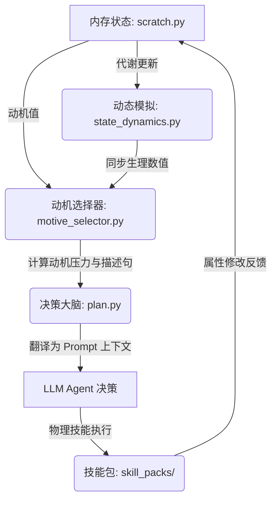

# Generative Agents — 驱动与动机系统设计说明书

本文档系统介绍了项目中 **驱动（Drive）与动机（Motivation）系统** 的整体设计。该系统通过将数值化的生理指标与层级化的心理动机相结合，为 NPC 提供了自下而上（生理驱动）与自上而下（目标与社交驱动）有机结合的决策运行机制。

---

## 1. 核心设计理念与双层驱动架构

智能体的行为绝非单一层面的硬编码脚本，而是基于生理状态与心理动机在虚拟物理世界中不断演化的结果。系统设计了两个层级的驱动源：

1.  **生理指标层 (Core State Drives)**：直接关联智能体的生物存活与基础续航，包括饱腹度、精力、健康度、情绪。
2.  **心理动机层 (Psychological Motives)**：模拟人类的高级心理需求（参考马斯洛需求层次理论），如安全感、归属感、自主权、胜任感、生命意义等。

系统通过以下闭环不断驱动智能体运转：

---

## 2. 生理指标（Drives）与动态模拟机制

底层物理世界遵循客观代谢规律，每一模拟步（step）中智能体的基本数值都会根据其正在执行的动作产生不同的动态衰减或恢复。

### 2.1 生理指标定义
*   **饱腹度 (Satiety)**：初始值 60.0。每步自然衰减 $-0.08$（睡眠时衰减 $-0.04$）。
*   **精力 (Stamina)**：初始值 75.0。每步自然衰减 $-0.04$（移动寻路时惩罚为 $-0.07$），睡眠时每步恢复 $+0.15$，静止休息时每步恢复 $+0.08$。
*   **情绪 (Mood)**：初始值 60.0。自然状态下每步衰减 $-0.06$，在社交状态下每步恢复 $+0.30$。
*   **健康度 (Health)**：初始值 85.0。属于安全红线。当 `Satiety` 或 `Stamina` 归 $0$ 时，健康度将分别遭受每步 $-0.05$ 或 $-0.02$ 的持续受损。

### 2.2 动态更新引擎
在每一步的主循环中，通过 [apply_step_state_dynamics](file:///Users/gun/mygame/generative_agents/reverie/backend_server/persona/cognitive_modules/state_dynamics.py#L90-L110) 实时调用 [derive_step_state_deltas](file:///Users/gun/mygame/generative_agents/reverie/backend_server/persona/cognitive_modules/state_dynamics.py#L17-L87) 计算出数值变化，并写回到智能体的 [scratch.py](file:///Users/gun/mygame/generative_agents/reverie/backend_server/persona/memory_structures/scratch.py) 内存中。

---

## 3. 心理动机（Motives）与压力选择算法

除了生理需求外，系统拓展了 10 个维度的动机状态。动机的选择采用基于安全线偏差、危机线偏差及权重参数的**压力值（Pressure Score）**算法。

### 3.1 动机配置表
每个动机在系统内都预设了不同的初始值、安全线与衰减率：

| 动机维度 (Motive) | 物理映射对象 | 初始值 | 安全阈值 | 危机阈值 | 衰减率 | 权重 (Priority Weight) |
| :--- | :--- | :---: | :---: | :---: | :---: | :---: |
| **satiety (饱腹感)** | `satiety` | 60.0 | 50.0 | 25.0 | 0.08 | 1.00 |
| **stamina (精力值)** | `stamina` | 75.0 | 45.0 | 20.0 | 0.04 | 1.00 |
| **health (健康恢复)**| `health` | 85.0 | 55.0 | 25.0 | 0.00 | 1.20 |
| **safety (安全防范)**| - | 65.0 | 45.0 | 20.0 | 0.01 | 1.05 |
| **mood (情绪调节)** | `mood` | 60.0 | 50.0 | 30.0 | 0.03 | 1.00 |
| **belonging (归属感)**| - | 58.0 | 45.0 | 25.0 | 0.02 | 0.95 |
| **status (地位竞争)** | - | 55.0 | 42.0 | 24.0 | 0.01 | 0.90 |
| **autonomy (自主权)** | - | 62.0 | 45.0 | 25.0 | 0.01 | 0.90 |
| **competence (胜任感)**| - | 60.0 | 46.0 | 28.0 | 0.015| 0.92 |
| **meaning (生命秩序)**| - | 58.0 | 44.0 | 26.0 | 0.01 | 0.88 |

### 3.2 压力计算公式
在 [_compute_pressure](file:///Users/gun/mygame/generative_agents/reverie/backend_server/persona/cognitive_modules/motive_selector.py#L276-L334) 中，每个动机都会计算三个偏差占比：
*   **基线偏差**：$baseline\_gap = \max(0.0, \frac{initial - current}{initial})$
*   **安全偏差**：$safe\_gap = \max(0.0, \frac{safe - current}{safe})$
*   **危机偏差**：$critical\_gap = \max(0.0, \frac{critical - current}{critical})$

压力得分公式：
$$\text{pressure\_score} = baseline\_gap \times 0.35 + safe\_gap \times 0.95 + critical\_gap \times 1.8 + \max(0.0, priority\_weight - 1.0) \times 0.25 + decay\_per\_step \times 2.5 + \text{urgency\_bonus}$$
*   **Urgency Bonus (危机加成)**：
    *   $current \le critical \implies \text{urgency\_band} = \text{"critical" (危机)} \implies +1.2$ 加成。
    *   $current \le safe \implies \text{urgency\_band} = \text{"warning" (警戒)} \implies +0.35$ 加成。
    *   否则为 $\text{"stable" (稳定)}$，无额外加成。

### 3.3 主次动机生成机制
在 [select_motives](file:///Users/gun/mygame/generative_agents/reverie/backend_server/persona/cognitive_modules/motive_selector.py#L362-L440) 中：
1.  **第一优先 (Dominant Motive)**：根据压力值由大到小排序，且 `critical > warning > stable`，选出压力最高的动机作为**主动机**。
2.  **第二优先 (Secondary Motive)**：第二排名的动机只有在自身处于 `critical`、`warning` 或其压力得分不低于主动机得分 $60\%$ 且不小于 0.35 时，才会被作为次要动机展示，否则为空。
3.  **警戒动机 (Guard Motive)**：将当前任意处于 `critical` 阶段的生理或心理状况作为警戒状态。
4.  **自然语言句式转换**：将主次动机拼接成大模型理解的中文长句注入 prompt。例如：“我很饿，我很想进食；我身体不舒服，我想先恢复状态。”

---

## 4. 大模型决策翻译与规则注入管线

在规划决策阶段，通过认知层进行翻译。系统将复杂的生理数值和抽象动机，转换成智能体能够感知的“主观感受”和“物理警告规则”：

1.  **数值口语化转换**：
    在 [_build_homeostasis_status_summary](file:///Users/gun/mygame/generative_agents/reverie/backend_server/persona/cognitive_modules/plan.py#L1040-L1100) 中，将数值转成自然语言的主观表达。例如精力 25% 不会直接塞给 LLM 25%，而是描述为：
    *   `Interpretation: exhausted. Feeling: Your body feels extremely heavy and drained. Behavioral Hint: rest or sleep is highly recommended.`
2.  **危机强制规则注入**：
    在 [decide_demand_action](file:///Users/gun/mygame/generative_agents/reverie/backend_server/persona/cognitive_modules/plan.py#L2245-L2420) 中，若 `Satiety` 或 `Stamina` 低于警戒线（$< 30.0$），则会在 Prompt 头部强制置顶注入一条逻辑生存法则（Biological Rules），直接限制 LLM 的可选范围：
    *   例如：*“CRITICAL HOMEOPATHY RULE: Satiety is critically low! Since your inventory is empty, you MUST select 'Gather' targeting refrigerator/stove to acquire food.”*
3.  **生存特权机制 (Survival Privilege)**：
    系统注入特别条款声明：“智能体在饥饿或极度疲惫时，其日常的规划和工作职责自动失效，智能体拥有擅离职守、寻找食物或直接睡眠的绝对特权”，从而确保了本能驱使的优先级绝对高于社交和日常角色职责。

---

## 5. 技能反馈与行为结算闭环

当智能体通过大模型决策决定去执行某个特定动作（例如进食 `Consume`），并在物理世界到达目标点开始执行时：

1.  **物理预校验**：[BaseSkillPack.can_execute](file:///Users/gun/mygame/generative_agents/reverie/backend_server/persona/cognitive_modules/skill_packs/base.py#L127) 检查执行前置（背包有无食物、目标是否可达）。
2.  **物理与认知结算**：执行技能时（如 [ConsumeSkillPack.on_arrive](file:///Users/gun/mygame/generative_agents/reverie/backend_server/persona/cognitive_modules/skill_packs/consume_skill.py#L104-L227)），会同时触发物理变化与动机数值改变：
    *   调用 `apply_declared_base_state_effects` 使得物理饱腹值提升 40.0，健康度恢复 5.0。
    *   调用 `apply_declared_motive_effects` 使心智层面的 `satiety` 动机值提升 18.0，`mood` 动机值恢复 4.0。
3.  **心智记忆反哺**：通过 `record_stat_change_experience` 将生理恢复过程记录为高 Poignancy (情感强度) 的情节记忆写入智能体记忆库，巩固其对该物理对象的正向认知。

---

## 6. 系统设计优势评估

1.  **具身智能的质变**：将“饱腹度、精力”等底层物理环境压力直接转换为“我很饿、我很想进食”的主观动机短语，使 LLM 能以具身代入的方式进行推理。
2.  **弹性的保命防火墙**：在安全区间，Agent 依靠动机和个性规划生活；在濒死边缘，通过 Homeostasis 规则置顶强行接管规划，既实现了长周期运行的高鲁棒性，又保持了日常生活的多样性。
3.  **物理和心智维度的分离与交互**：状态衰减由物理世界时间驱动，行为恢复由动作事件驱动，而心理动机在此基础上进行了非线性的“偏差积分”，为 NPC 塑造了稳定且有深度的内在心理动机状态。
