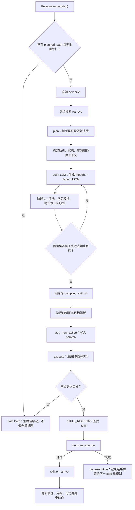

# 从 Step 全量推理到 Skill 落地执行

本文档描述当前默认配置下，NPC 从一个模拟 step 开始，到完成全量决策、动作编译、目标解析、寻路并最终执行 Skill 的真实运行时调用链。

默认配置为：

```text
ENABLE_JOINT_DECISION_PIPELINE=1
```

在该配置下，系统使用一次 Joint LLM 调用同时生成自然语言 thought 和结构化动作 JSON。阶段 2 主要负责本地清洗、校验和 Skill 编译，不再默认调用第二个翻译 LLM。

## 1. 总体流程



## 2. Step 入口与 Fast Path

主入口是：

```text
reverie/backend_server/persona/persona.py
Persona.move()
```

每个 step 开始时，系统更新：

- `scratch.curr_tile`
- `scratch.curr_step`
- `scratch.curr_time`

之后首先处理死亡状态。健康值小于等于 0 时，NPC 原地冻结，不再进入认知流程。

如果 NPC 仍有 `planned_path`，当前不是新的一天，并且没有生理危机打断，系统进入 Fast Path：

1. 保留当前动作和目的地。
2. 跳过全量决策和 LLM。
3. 必要时进行轻量社交扫描。
4. 调用 `execute()` 向路径下一格移动。

因此，并不是每个 step 都执行全量推理。正常情况下，一次全量决策生成路径，后续多个 step 只负责移动。

## 3. 生理危机打断

危机判断位于：

```text
reverie/backend_server/persona/memory_structures/scratch.py
Scratch.should_interrupt_for_physiological_crisis()
```

当前阈值为：

- `satiety < 30.0`
- `stamina < 30.0`

如果当前动作已经在解决对应生理需求，例如正在觅食、进食或休息，则不会打断。

如果当前动作与危机无关，系统会：

1. 暂存当前动作。
2. 清除当前路径。
3. 记录 `physiological_crisis` 中断原因。
4. 进入本 step 的全量认知流程。

## 4. 感知、检索与规划入口

全量认知流程依次执行：

```text
perceive -> retrieve -> plan -> reflect -> execute
```

### 4.1 感知

`perceive()` 读取附近人物、物体及事件，生成当前 step 的可感知信息。

### 4.2 记忆检索

`retrieve()` 使用感知结果检索相关事件和想法，结果保存到：

```text
scratch.last_retrieved_memories
```

### 4.3 判断是否需要新决策

规划入口位于：

```text
reverie/backend_server/persona/cognitive_modules/plan.py
plan()
```

只有满足以下条件之一时，才调用 `decide_demand_action()`：

- 当前动作已经完成。
- 当前动作执行失败。
- 当前动作被中断。
- 当前动作描述为空。

如果存在可恢复的暂存动作，系统可能直接恢复该动作，而不进行新一轮 LLM 决策。

## 5. 全量决策上下文构建

全量即时决策入口是：

```text
reverie/backend_server/persona/cognitive_modules/plan.py
decide_demand_action()
```

它会组装以下信息：

- 当前时间。
- 饱腹、精力、健康、情绪等状态。
- dominant motive、secondary motive 和 guard motive。
- 背包物品。
- NPC 已知的世界物体。
- 资源当前状态和资源实例地址。
- 附近合作与社交事件。
- 上一个动作及最新执行结果。
- 当前 intent family。
- 与 intent 相关的最多 5 条经验记忆。
- 最近失败目标和 `InvalidTargets`。
- 静态资源上下文。
- 管理员指令。

动机选择和上下文组装是本地逻辑，不调用 LLM。

## 6. Joint LLM 决策

决策管线入口是：

```text
reverie/backend_server/persona/cognitive_modules/plan.py
_run_decision_pipeline()
```

默认调用：

```text
run_gpt_prompt_joint_decision()
```

Joint LLM 一次返回 thought 和结构化动作，例如：

```json
{
  "schema_version": 2,
  "thought": "I should gather food from the apple tree.",
  "action": "Gather",
  "target": "apple tree",
  "target_type": "object",
  "mode": "gather",
  "topic": "",
  "detail": "gathering apples from the apple tree",
  "duration": 10,
  "reasoning": "Hunger is the dominant immediate need."
}
```

当前默认流程可理解为：

```text
阶段 1 上下文编译
  -> Joint LLM 同时完成思考与动作选择
  -> 阶段 2 本地清洗、校验和编译
```

只有关闭 Joint Pipeline 时，才进入旧流程：

```text
demand_thinking LLM
  -> action_translation LLM
```

## 7. 阶段 2 清洗与校验

Joint 响应的清洗入口位于：

```text
reverie/backend_server/persona/prompt_template/run_gpt_prompt.py
run_gpt_prompt_joint_decision()
```

结构化契约处理位于：

```text
reverie/backend_server/persona/cognitive_modules/structured_action_intent.py
```

处理步骤包括：

1. 提取并解析 JSON。
2. 规范化 `target_type`。
3. 修复下划线枚举。
4. 转换可恢复的 mode 别名。
5. 在 mode 为 `none` 时根据 action 推断模式。
6. 修正 duration。
7. 校验必填字段、schema 版本、action、target type、mode 和 duration。

当前支持的部分别名包括：

| LLM 输出 | 标准 mode |
|---|---|
| `chat` | `conversation` |
| `chat with` | `conversation` |
| `request_resource` | `request` |
| `ask_for_help` | `request` |
| `leisure_use` | `solo_leisure` |

`Consume` 和 `Request` 允许 5 到 120 分钟，其他动作允许 10 到 120 分钟。可恢复的格式差异由本地修复，不重新请求 LLM。

如果响应仍不合法，安全生成器最多再尝试一次。如果动作目标命中 `InvalidTargets`，决策管线还可能携带失败反馈重新进行一次 Joint 决策。

## 8. 编译为运行时 Skill

校验通过后调用：

```text
compile_action_intent()
```

它把 LLM 面向的 action、target type 和 mode 编译成稳定的运行时 `compiled_skill_id`。

常见映射如下：

| LLM 决策 | compiled_skill_id |
|---|---|
| `Socialize + persona` | `seek_and_chat` |
| `Recreate + social_venue` | `hangout_social_venue` |
| `Recreate + solo_leisure` | `leisure_use` |
| `Gather` | `gather` |
| `Consume` | `consume` |
| `Request` | `request` |

这一步是纯本地逻辑，不调用 LLM。

## 9. 执行前语义纠正

编译之后，`plan.py` 还会执行一层本地纠正：

- 缺失 Consume 目标时，尝试从背包补全食物目标。
- 缺失 Rest 目标时，尝试寻找床或沙发。
- 缺失地点目标时，尝试补全可用地点。
- 社交人物和社交地点会被分流到不同 Skill。
- 空背包时，`Consume + 食物资源` 会转换为 `Gather`。
- 低饱腹且 Gather 目标无效时，会重新选择食物来源。

需要注意：当前代码中仍存在以下硬编码食物来源列表：

```text
refrigerator
stove
cafe counter
apple tree
```

这些规则不在 LLM 提示词中，而位于 LLM 决策后的执行纠正层。它们会影响 LLM 原始动作最终如何落地。

## 10. 目标地址解析

系统随后把抽象 target 转换成地图地址：

- 人物目标转换为 `<persona> NPC名字`。
- 背包食物转换为当前位置原地消费。
- 地点或物体转换为 `world:sector:arena:object`。
- Gather 会结合成功和失败经验选择具体资源实例。
- 确定性匹配失败后，才使用旧的 sector、arena、object LLM fallback。

因此，默认 Joint 决策只需要一次主要 LLM 调用，但在地图目标无法本地解析时，仍可能产生额外的位置解析 LLM 调用。

## 11. 写入 Scratch 动作状态

目标解析成功后调用：

```text
reverie/backend_server/persona/memory_structures/scratch.py
Scratch.add_new_action()
```

写入的主要字段包括：

- `act_address`
- `act_duration`
- `act_description`
- `act_pronunciatio`
- `act_event`
- `act_command.skill_id`
- `act_command.target`
- `act_obj_event`
- `action_record`

写入前还会经过 action switch 和 commit window 检查。如果新动作属于不合理的快速切换，系统可能拒绝替换当前动作。

新动作接受后会设置：

```text
act_path_set = False
```

表示下一步需要为该动作生成路径。

## 12. 寻路和逐步移动

执行入口是：

```text
reverie/backend_server/persona/cognitive_modules/execute.py
execute()
```

当 `act_path_set` 为 false 时，系统：

1. 根据 `act_address` 获得候选 tile。
2. 扩展可接近目标的邻近 tile。
3. 尽量避开已经被其他 NPC 占据的位置。
4. 使用 `path_finder` 计算最短可达路径。
5. 将剩余路径写入 `planned_path`。
6. 将执行状态更新为 `pathing`。

如果无法找到路径：

1. 记录 `path_not_found`。
2. 写入失败经验和目标地址。
3. 调用 `fail_execution()`。
4. 清理当前路径和动作。
5. 下一 step 重新进入决策。

如果路径有效，本 step 移动一格，后续 step 通过 Fast Path 继续移动。

## 13. 到达后分发 Skill

当以下条件同时成立时，NPC 被视为已经到达：

```text
planned_path 为空
act_path_set 为 true
```

系统读取：

```text
act_command.skill_id
act_command.target
```

然后通过：

```text
reverie/backend_server/persona/cognitive_modules/skill_packs/__init__.py
SKILL_REGISTRY
```

查找对应 Skill 实例。

`survival_applied` 用来保证同一次到达只触发一次 Skill 结算。

## 14. Skill 执行生命周期

每个 Skill 的核心接口为：

```python
skill.can_execute(persona, target, maze)
skill.on_arrive(persona, target, maze, personas)
```

### 14.1 can_execute

`can_execute()` 检查客观执行条件，例如：

- 背包是否有可消费食物。
- 资源是否已经耗尽。
- 目标 NPC 是否存在。
- 是否具有可转移物品。
- 当前地点是否支持该动作。

失败时返回 false，并通过 precheck result 提供结构化原因和 payload。

### 14.2 on_arrive

通过检查后调用 `on_arrive()`，负责真实世界效果，例如：

- Gather：减少资源库存并增加 NPC 背包物品。
- Consume：减少背包物品并增加饱腹、健康和情绪。
- Rest：恢复精力。
- Socialize：进入对话流程并改变情绪或关系。
- Request：向目标 NPC 请求资源。

### 14.3 成功结束

成功时调用 `finish_success()`：

1. 记录动作完成。
2. 更新属性、库存和经验。
3. 更新动作 outcome。
4. 释放当前执行状态。
5. 清空当前路径和动作。

### 14.4 失败结束

失败时调用 `finish_failure()` 或 `fail_execution()`：

1. 保存失败原因、目标和 payload。
2. 写入 action outcome。
3. 将失败反馈留给经验和记忆系统。
4. 释放当前动作。
5. 下一 step 重新进入全量决策。

## 15. LLM 调用边界

一次正常的默认全量决策通常只包含一次主要 LLM 请求：

```text
Joint Decision LLM
```

以下情况可能增加调用：

- Joint JSON 无法解析或无法本地修复。
- 决策命中 `InvalidTargets`，触发一次带反馈的重决策。
- 本地目标地址无法解析，进入 sector、arena 或 object LLM fallback。
- 到达后进入需要生成自然语言内容的复杂社交 Skill。
- 反思系统达到触发条件。

以下步骤不调用 LLM：

- 生理危机判断。
- 动机数值选择。
- 经验记忆检索。
- 阶段 2 别名和 duration 修复。
- `compile_action_intent()`。
- 大部分确定性目标解析。
- 寻路和逐格移动。
- Skill 客观条件检查。
- 属性、库存和资源结算。

## 16. 关键日志

排查该链路时，优先检查：

| 日志 | 用途 |
|---|---|
| `logs/step_timing.jsonl` | 区分 full pipeline 和 fast path，并查看各阶段耗时 |
| `logs/llm_request_events.jsonl` | 查看 LLM 原始响应、校验结果、缓存和请求耗时 |
| `logs/decision_prompt_trace.jsonl` | 查看最终提示词和决策结果 |
| `logs/translation_verify.jsonl` | 查看动作编译、纠正及目标解析 |
| `logs/action_execution_debug.jsonl` | 查看路径、到达、Skill 查找和执行结果 |
| `logs/skill_debug.jsonl` | 查看具体 Skill 的 precheck 和结算过程 |
| `logs/decision_stability.jsonl` | 查看动作切换、commit window 和中断 |

## 17. 一次决策跨多个 Step 的典型时序

```text
Step 100
  full_pipeline
  -> LLM 决定 Gather apple tree
  -> 编译为 gather
  -> 解析苹果树地址
  -> 写入动作
  -> 生成路径
  -> 移动第一格

Step 101 ... 109
  fast_path
  -> 不调用 LLM
  -> 每 step 沿 planned_path 移动一格

Step 110
  fast_path / execute
  -> 到达苹果树
  -> GatherSkill.can_execute()
  -> GatherSkill.on_arrive()
  -> 苹果树资源减少
  -> NPC 背包增加苹果
  -> 动作完成并释放

Step 111
  full_pipeline
  -> 当前动作已完成
  -> 重新结合饱腹、背包和经验选择下一动作
```

