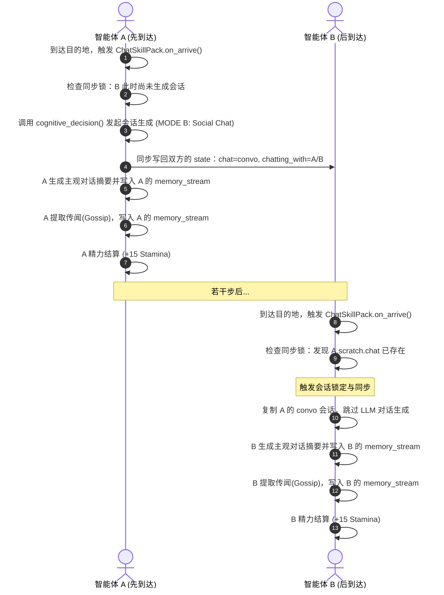

# Generative Agent 聊天系统设计说明书 (Chat System Design Document)

本文档旨在阐明重构后的 Generative Agent 聊天系统的核心架构、业务流程与物理-认知解耦设计。该设计全面废弃了原有的“前置规划时生成对话”的耦合式设计，完全迁移至 **Chat Skill Pack（聊天技能包）** 模块化体系中。

---

## 1. 系统核心设计哲学：延迟执行 (Lazy Execution)

在 Agent 模拟世界的早期设计中，规划阶段（`plan.py`）过于沉重，智能体在刚刚决定与人聊天、甚至还没迈出一步时，就急于调用大模型（LLM）生成完整的对话内容。这造成了“预知未来”的时序耦合。

新版聊天系统遵循**“物理底座 - 认知大脑”的去特化解耦铁律（Rule 3）**，采用**“延迟执行（Lazy Execution）”**的轻量化设计：
- **规划阶段（Plan）**：仅做出“聊天意图判定”（Intent Decision），并在日程表中插入一个占位符事件（Placeholder），设定预估交互时间（如 10 分钟），不执行任何 LLM 对话内容生成。
- **执行阶段（Execute）**：只有在智能体通过寻路物理走近对方、到达相邻瓦片并结束移动时，才由物理结算层触发 **Chat Skill Pack**，进行会话内容的一次性动态生成、属性扣减和记忆流写入。

---

## 2. 聊天生命周期与时序流程 (Dialogue Lifecycle)

重构后的聊天系统生命周期分为以下三个阶段：

### 阶段一：意图判定与占位规划 (Planning & Intent)
在每一步的 `move()` 循环中，智能体 A 感知到周围存在智能体 B，开始判定是否聊天：
1. **决策校验**：`plan.py` 中的 `_should_react()` 调用 `lets_talk()`。校验基本物理状态（对方未入睡、非深夜、距离上次聊天冷却 Buffer 已归零等）。
2. **LLM 意图判定**：调用 `generate_decide_to_talk` 让大模型根据检索的背景记忆和当前场景决定是否开启聊天。
3. **占位表注入**：若决定聊天，调用 `_chat_react` 修改两个智能体的日程表（`f_daily_schedule`），插入 `having a conversation with {Interlocutor}` 占位动作，并设定默认交互时长（10分钟），同时规划移动路径，不再提前调用任何多轮对话生成器。

### 阶段二：移动与物理寻路 (Pathing)
1. 双方开始向对方的坐标寻路移动。
2. 只要 `planned_path` 尚存，角色在地图上显示为走动状态，不触发对话。

### 阶段三：到达与 Skill 延迟结算 (Arrival & Physical Settlement)
当智能体走完路径到达对方相邻瓦片时，`execute.py` 检测到当前的动作为 `chat with`，拦截并分发至 `ChatSkillPack` 的 `on_arrive()` 方法：

---

## 3. 关键机制设计 (Key Mechanisms)

### 3.1 会话同步锁与防刷冷却 (Coordination Lock & Cooling Buffer)
由于分布式多 Agent 运行步调不一致，A 先到达，B 后到达，若不加控制，双方都会各自调用 `cognitive_decision`，生成两份不同的聊天记录。
- **会话同步锁**：当智能体执行 `on_arrive()` 时，先检索对方的 `scratch` 状态。若检测到 `target_p.scratch.chatting_with == self.name` 且 `target_p.scratch.chat` 已有内容，说明对方已主导生成了本次对话。此时，智能体直接克隆并接入该会话内容，跳过 `cognitive_decision` 大模型调用。
- **防止无限聊天机制**：一旦会话完成，系统会为双方写入 `chatting_with_buffer[对方名字] = 800`。在随后的 800 秒/Tick 内，大模型决策层将拒绝主动发起与该角色的聊天。

### 3.2 主观记忆总结与八卦传播 (Subjective Summary & Gossip)
虽然会话内容是一致的，但智能体对会话的理解和学到的知识是个性化的：
1. **主观总结**：每个智能体到达后，独立调用 `run_gpt_prompt_summarize_conversation`。系统会根据智能体自身的性格和视角，总结这段对话（如 A 认为聊得很开心，B 认为对方有些啰嗦），并将生成的总结 node 写入**各自**的 Memory Stream。
2. **传闻提取 (Gossip Extraction)**：每个智能体独立调用提取 Prompt，从对话文本中分析“自己从对话中学到了关于镇上其他人的什么八卦”，并以 `[Subject] heard that [Gossip_content]` 的节点形式独立添加到自己的记忆流中，实现 rumor propagation（谣言/八卦传播）。

---

## 4. “去特化”架构（Rule 3）对照与演进

| 功能模块 | 遗留设计 (Legacy Double-Generation) | 现行 Chat Skill 设计 (Refactored) |
| :--- | :--- | :--- |
| **生成时机** | **Eager 规划期生成**。双方未见面即在大脑中模拟完整会话。 | **Lazy 到达后生成**。走到对方面前才开始动态交谈。 |
| **Token 消耗** | 规划期生成一次 + 物理到达后 Skill 重复生成一次（**造成双重 LLM 生成浪费**）。 | 仅在先到达一方调用 LLM 生成一次会话，另一方同步接入（**单次生成，无冗余**）。 |
| **记忆一致性** | 日程表摘要基于第一份会话，最终记忆节点基于第二份会话，导致**日程与记忆脱节**。 | 统一基于实际发生的单次会话进行总结和 Gossip 提取，**逻辑完全闭环**。 |
| **咖啡社交硬编码** | 强制 Klaus 和 Isabella 在 Cafe 柜台触发会话，强制修改日程（违反 Rule 3）。 | **完全移除硬编码**。聊天纯粹由大模型大脑（ISS 状态与记忆检索）决定，回归物理底座物理量结算。 |

---

## 5. 模块文件映射 (File Mapping)

- **规划驱动层**：[plan.py](file:///g:/generative_agents/reverie/backend_server/persona/cognitive_modules/plan.py)
  - 职责：意图生成与日程表占位表注入。
- **物理分发器**：[execute.py](file:///g:/generative_agents/reverie/backend_server/persona/cognitive_modules/execute.py)
  - 职责：寻路移动，并在抵达时从 `SKILL_REGISTRY` 调度 `ChatSkillPack`。
- **业务实现与物理结算层**：[chat_skill.py](file:///g:/generative_agents/reverie/backend_server/persona/cognitive_modules/skill_packs/chat_skill.py)
  - 职责：会话同步锁校验、LLM 社交对话生成（Mode B）、主观总结、Gossip 提取与物理量代谢结算。

---

## 6. 聊天对智能体行为的深层影响 (Behavioral & Cognitive Impact)

聊天绝非简单的气泡显示，它通过**“属性影响 -> 记忆注入 -> 认知检索 -> 改变决策”**的闭环，动态重塑小人的整套行为：

### 6.1 与造物主（Creator）聊天的特权与影响
当你在前端下达指令或对话时，触发 `ChatSkillPack` 的 `MODE C`（造物主沟通模块），产生以下专属特权物理与认知结算：
1. **紧急行为强制打断 (Behavior Interruption)**：
   - 如果你的输入属于指令类型（`instruction`），小人的物理层会进行模糊目标映射，并调用 `add_new_action` **立即插入紧急高优先级任务**，同时将原本进行的寻路动作和规划清空。
   - 小人头顶会显示敬礼表情 **`🫡`** 以表达对造物主的顺从，并在下步走去执行该命令。
2. **最高重要度记忆写入 (High-Poignancy Memory)**：
   - 沟通完成后，在小人的 Associative Memory 中注入一条事件节点：`"{name} received message from Creator and replied: '{reply}'"`。
   - 该记忆的 **Poignancy（重要度评分）被强制设为满分 `10`**。在后期的感知检索中，该记忆极易被大脑提取，作为长期指导行动的关键决策上下文。
3. **精力大幅恢复 (Stamina Boosting)**：
   - 接受造物主的指令与关怀，会给智能体带来心流状态，**Stamina 直接充能 +20.0 点**。

### 6.2 NPC 间社交聊天的动态影响
1. **传闻与八卦传播机制 (Rumor Propagation)**：
   - 双方聊天时，倾听者会运行 Rumor Extraction 提取对话中的传闻（例如 A 谈及 Isabella 的新咖啡）。
   - 提取到的谣言会转化为 `"{name} heard that {gossip}"` 节点存入记忆流（Poignancy 为 `5`）。在未来的活动中，小人会将该传闻传播给第三人。
2. **关系重塑与日间反思 (Reflection & Relation)**：
   - 每次聊天的总结摘要会被存入记忆。当小人累积了一定数量的记忆进入 **Reflect（反思）** 状态时，会根据这些聊天片段生成高层级的主观思想认知（如对某人的偏好、工作机会等），从而在后续的每日规划（Daily Planning）中改变行程或行为倾向。
3. **精力物理代谢恢复 (Stamina Recovery)**：
   - 社交行为能够有效消除孤独感，单次会话结算时，**双方的 Stamina 均会恢复 +15.0 点**。

---

## 7. 前后端时钟与状态一致性同步锁机制 (Lockstep Synchronization & Heartbeat Lock)

在最初的架构中，前端网页只是一个纯粹的“动画播放器（Viewer）”，后台模拟器引擎（`reverie.py`）单向向 Django 广播动作并不断推演。这种单向解耦模型会导致“时空脱节”：后端可能已经跑到 Step 700，而前端由于动画播放较慢只播到 Step 150，此时用户与智能体交互会导致认知错乱与时间悖论。

为了实现真正的即时交互，系统引入了 **前后端步进锁同步机制（Lockstep Synchronization）**：

### 7.1 前台活跃心跳 (Heartbeat Check)
1. **心跳标记**：当浏览器播放器处于活跃状态时，其在请求 `update_environment` 或 `process_environment` 接口时，Django 服务端会自动在临时存储目录更新心跳文件 `temp_storage/frontend_active_{sim_code}.json`，记录最新的活跃时间戳。
2. **状态感知**：后端模拟器在每一轮 Step 开始前，会读取该心跳文件。
   - **心跳有效 (Within 10s)**：判定玩家正在浏览器观看模拟。
   - **心跳无效/超时**：判定没有活跃的前台（如 headless 模式或浏览器已关闭）。

### 7.2 锁步推演与解耦退避
1. **Lockstep 挂起状态**：若检测到前台活跃，后台引擎在请求 `api_get_environment` 时，若 Django 尚未返回对应当前 Step 的环境帧数据（说明前端还在播放前一步的动画，尚未上报当前步的最新位置），后台会**强行暂停（阻塞等待）**，以 0.5s 的间隔进行轮询。这保证了后台大模型的推演时钟与玩家浏览器的动画时钟达到秒级完全对齐。
2. **交互即时生效**：由于时钟对齐，玩家在第 157 步下达的指令和聊天输入，会被后台在第 157 步的实时内存状态中立刻处理。小人在大模型回复后起立、转向、回话等动作将立刻在第 158 步的前端画面中呈现。
3. **Headless 自动降级退避**：当玩家关闭浏览器，心跳超时（10秒）后，挂起循环会自动打断。后台引擎自动降级为“解耦运行模式”，恢复最大推演速度（0.1s/步），从而兼顾了“高即时交互性”与“无锁自动化推演”的双重需求。
