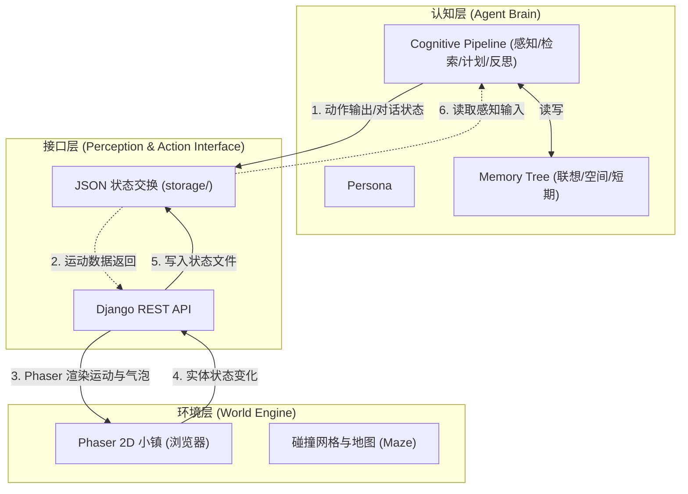

# Generative Agents — 核心技术架构与认知机制指南

本文档系统介绍了 Generative Agents 项目的核心技术架构设计、三大核心认知机制，以及本地项目最近引入的技术改造与性能优化。

---

## 💡 架构设计三大铁律 (Three Golden Rules)

在对本项目进行任何认知管线重构、代谢数值调整、或行为拦截器设计时，必须严格遵守以下三大铁律，使智能体拥有“随机应变”的生命力，而非僵硬的固定演出：

1.  **铁律 1：认知大脑（LLM）负责“随机应变”**  
    智能体不应遵循死板的预设行为脚本。系统在每一步将足够的环境状态、生理数值及记忆上下文组装并塞给大模型，由大模型这个“认知大脑”给出具体方案和行动（自主决策）。
2.  **铁律 2：硬编码仅负责“物理底座”**  
    代码应当且仅应当用于构建底层世界的“客观规律”（如代谢值衰减、生命值扣减、物理碰撞与阻挡等约束），作为不可逾越的物理和生理规则。
3.  **铁律 3：消除行为与社交逻辑的硬编码（去特化）**  
    一切属于社会学或人际交互的行为逻辑（例如：进食前必须等待服务员端咖啡、主动找某人对话等），决不能通过死板的逻辑代码硬编码写死，而应通过底层物理事件或属性改变，由大模型大脑自主决定行动方案。

*   **哲学实质**：整个系统本质上是一个**模拟全要素的虚拟现实（Full-Element VR）世界**。系统本身的硬编码逻辑只负责聚合小镇的环境、时间上下文（如当前时刻、星期及动作倒计时等时间要素）、角色生理与记忆等全要素数据并组装成提示词提供给 LLM，在得到大脑的认知决策后予以执行。系统本身只用于维护虚拟世界的客观规律（如碰撞、**以时间/步数为驱动的代谢值衰减**等物理底座），并不干涉任何社会习惯或行为时序。

---

---

## 目录
1. [系统三层架构](#1-系统三层架构)
   - [Cognitive Layer (认知层)](#11-cognitive-layer-认知层)
   - [Perception & Action Interface (感知与行动接口)](#12-perception--action-interface-感知与行动接口)
   - [Environment Layer (环境层)](#13-environment-layer-环境层)
2. [核心技术机制](#2-核心技术机制)
   - [Memory Stream (记忆流)](#21-memory-stream-记忆流)
   - [Reflection Mechanism (反思机制)](#22-reflection-mechanism-反思机制)
   - [Planning Mechanism (规划机制)](#23-planning-mechanism-规划机制)
3. [最近的技术改造与性能优化](#3-最近的技术改造与性能优化)

---

## 1. 系统三层架构

整个项目架构在逻辑上划分为清晰的三层结构，实现了“大脑计算”、“网络通信”与“环境渲染”的解耦：



### 1.1 Cognitive Layer (认知层)
认知层是智能体的“大脑”（Agent Brain），独立运行于后端 `reverie/` 容器中。
* **职责**：维护智能体的身份特质（ISS）、记忆库与思维流水线。在每一步（step）循环中，为每个智能体调用认知管线，产生下一个动作。
* **核心类**：`Persona` 聚合了联想记忆库（`AssociativeMemory`）、空间记忆树（`MemoryTree`）以及短期工作区（`Scratch`）。

### 1.2 Perception & Action Interface (感知与行动接口)
接口层是连接大脑与环境的桥梁（API），依托 Django 构建。
* **职责**：前后端通过异步读写 `storage/` 目录下的 JSON 状态交换文件来进行数据对齐。
* **输入感知**：前端将小镇当前的实体状态与用户输入（聊天、指令）以 JSON 文件形式写入 `environment/{step}.json`，后端读取进行感知。
* **行动输出**：后端计算完毕后，将行动路径与气泡对话写入 `movement/{step}.json`，前端轮询该接口获取并渲染。

### 1.3 Environment Layer (环境层)
环境层是物理世界引擎（World Engine），由前端 Phaser 游戏框架与后端 `Maze` 类共同定义。
* **职责**：处理小镇网格坐标、碰撞检测（障碍物物理屏障）和环境家具状态变化。
* **核心类**：`Maze` 维护了 2D 瓦片地图上的碰撞矩阵（`collision_maze`）、区域映射（`address_tiles`）以及挂载在各瓦片上的环境事件集（`events`）。

---

## 2. 核心技术机制

智能体的社会涌现性源自“记忆-反思-规划”的三元认知循环：

### 2.1 Memory Stream (记忆流)
记忆流是智能体的核心数据结构，它记录了智能体所有体验的综合时间线。

> [!NOTE]
> 智能体拥有三层记忆模型：
> 1. **Spatial Memory (空间记忆树)**：三层级树状字典，记录其认知范围内的“World → Sector → Arena → Game Object”层级结构，用于空间定位。
> 2. **Associative Memory (联想记忆流)**：以 `ConceptNode` 节点形式存储事件、想法和对话。
> 3. **Scratch (临时工作记忆)**：存储实时状态（当前目标、已规划路线、正在执行的动作等）。

#### 记忆检索算法 (`new_retrieve()`)
当智能体需要决策或对话时，系统使用该算法从记忆流中检索最相关的 $N$ 个记忆节点。检索评分基于三个维度的加权求和：
$$\text{Score} = w_{\text{recency}} \times \text{Recency} + w_{\text{relevance}} \times \text{Relevance} + w_{\text{importance}} \times \text{Importance}$$

| 维度 | 计算原理 | 说明 |
| :--- | :--- | :--- |
| **Recency (时近性)** | 指数衰减函数：$\lambda^{\Delta t}$ ($\lambda=0.995$)，$\Delta t$ 为时间间隔。 | 越近发生的事情得分越高。 |
| **Relevance (相关性)** | 对检索焦点文本与记忆节点描述计算**余弦相似度**。 | 语义上越接近当前焦点，得分越高。 |
| **Importance (重要性)** | LLM 评分机制：创建节点时利用 LLM 预先给事件重要性打分 (1-10)。 | 越关键的记忆（如升职、表白）得分越高。 |

---

### 2.2 Reflection Mechanism (反思机制)
反思机制是高阶认知的源泉。它使智能体能够定期总结琐碎的细节，形成对自身或他人的宏观印象（Insights）。

#### 触发条件
每感知一个新事件，反思计数器会扣减该事件的重要度：
$$\text{importance\_trigger\_curr} \gets \text{importance\_trigger\_curr} - \text{poignancy}$$
当计数器值 $\le 0$ 时，触发反思（默认阈值为 150）。

#### 执行步骤
1. **生成焦点**：LLM 根据最近的 100 条事件记忆，提出 3 个最能反映当前核心状态的问题（焦点）。
2. **检索关联**：利用 `new_retrieve()` 为这 3 个焦点检索相关的历史记忆。
3. **产生洞察**：LLM 检索并提炼记忆，产生 5 个具有普适性的客观想法（Insights），并链接到作为证据的节点 ID。
4. **归档想法**：将这些 Thoughts 作为新的记忆节点存回联想记忆库，并计算嵌入向量，使其可以被后续的规划与决策检索到。

---

### 2.3 Planning Mechanism (规划机制)
规划机制确保了智能体行为的长期一致性和日常合理性。

```
Plan Pipeline (规划流水线)
 ├── 长期规划 (醒来时生成一日粗粒度计划)
 ├── 细化日程 (将日计划细化为小时级日程)
 ├── 任务分解 (将 >60 分钟的任务递归分解为 5-15 分钟的微操)
 └── 动态社交反应 (感知到邻近智能体时, 决定是否聊天并插入临时日程)
```

1. **长期规划**：智能体在每天醒来时（通过 LLM 生成起床时间），会参考身份设定（Currently、Traits）生成一个粗粒度的一天行动方案。
2. **日程细化与分解**：在行动开始前，系统调用 `generate_task_decomp` 将大行动（如 "working on research"）细化为 5-15 分钟的子行动（如 "setting up desk", "reading papers"），并确定行动的物理目的地。
3. **社交规划**：当智能体相遇时，`_should_react` 结合他们的历史关系决定是打招呼、发起多轮对话（最多 8 轮），还是选择忽略并继续前行。

---

## 3. 最近的技术改造与性能优化

针对高延迟、高开销和易崩溃的瓶颈，本项目最近在软件层及架构层引入了多项关键改造：

### 🚀 3.1 认知管线并行化 (Concurrency)
* **改造前**：每一步（step）循环中，智能体的认知更新是串行执行的。当智能体数量增加时，延迟呈线性叠加。
* **改造后**：在 `reverie.py` 中引入 `ThreadPoolExecutor` 并行调度所有智能体的 `move()` 认知更新。使多核心硬件能够并发处理智能体的思维管线。

### ⚡ 3.2 快速路径跳过 (Fast Path Optimization)
* **改造前**：无论智能体处于什么状态，每一步都必须完整运行 Perceive → Retrieve → Plan → Reflect 的完整流程，造成了大量重复的 LLM 请求。
* **改造后**：当智能体处于**正在移动中（`planned_path` 非空）**且非新一天时，直接跳过完整的认知管线，仅调用 `Execute` 弹出下一格坐标。将行走状态下的 LLM 调用次数降低为 **0**。

### 💾 3.3 本地 LLM 与分级模型策略 (Ollama & Qwen 2.5)
* **模型集成**：利用 Ollama 本地运行兼容 OpenAI 接口的开源模型 `qwen2.5:7b`（用于对话与反思等高阶逻辑）和 `nomic-embed-text`（用于向量嵌入）。
* **分级策略**：通过分级配置加速执行。简单的分类与打分任务可使用较轻量的 `qwen2.5:3b`，复杂的生成任务使用 `qwen2.5:7b`，在低算力 GPU（如 GTX 1070 Ti）上实现了推理速度的翻倍。
* **输出限制**：限制最大生成 Token数（`max_tokens=256`），防止模型生成多余字符，节省推理开销。

### 📂 3.4 缓存机制 (Cache Systems)
* **磁盘 Prompt 缓存**：相同 prompt 的推理结果通过 `save_cache_to_disk` 持久化存储在本地 `.prompt_cache/`，再次遇到相同输入时直接读取，减少重复生成。
* **内存缓存**：对重要性评分（`poignancy`）和嵌入向量（`embeddings`）在运行时使用内存字典缓存，避免频繁的模型计算。

### 🛠️ 3.5 健壮的地址与位置匹配 (Robust Lookup & Sync)
* **case-insensitive 空间匹配**：重构了 `spatial_memory.py` 及 `execute.py` 的地址匹配。对所有检索词先执行 `strip().lower()` 预处理，并在找不到精确匹配时自动回退到大小写不敏感匹配、自动兼容 `"the Ville:"` 前缀，彻底避免了由于大小写不一致导致的 `KeyError` 崩溃。
* **物理位置边界拦截**：优化了 `execute.py` 物理拦截器的条件。只有当 Klaus 等智能体在物理上进入咖啡馆区域时，才会触发等待 Isabella 服务咖啡的阻塞，解决了智能体在宿舍床上就过早被拦截并陷入无限 LLM计算循环的缺陷。

### 🍏 3.6 生理稳态与代谢衰减模拟 (Physiological Homeostasis & Metabolic Decay Simulation)
* **生理状态扩展**：在 `Scratch` 记忆结构中挂载饱食度 (`satiety`)、精力值 (`stamina`)、生命值 (`health`) 以及背包 (`inventory`) 和技能树 (`skills`) 数据槽，支持在存档 JSON 中进行持久化读写。
* **物理代谢消耗**：主模拟循环每步（Step）均对数值进行衰减：正常活动每步扣减饱食度 `0.5`，行走移动时额外扣减精力，休眠与休息可按步恢复精力值并减缓饱食度流失。当饱食度衰竭为 0 时开始每步扣除 `2.0` 的健康值。
* **状态数据对齐**：生理稳态及背包数据实时串行化并输出到外部动作追踪 JSON 中，实现环境各要素的强耦合。

### 🔄 3.7 LLM 驱动的动态生存 ReAct 循环 (LLM-Driven Dynamic Survival ReAct Loop)
* **行为强制打断**：在 `Persona.move()` 中，当饱食度 < 30.0 或精力值 < 20.0 时，小人会自动打断常规日程、绕过“快速路径（Fast Path）”跳过机制，清空 A* 行走路径并触发求生规划。
* **生存决策规划**：通过 [plan.py](file:///g:/generative_agents/reverie/backend_server/persona/cognitive_modules/plan.py) 中的 `decide_survival_action`，提取已知地图物件（如冰箱、苹果树、咖啡馆座椅等），利用专属求生 Prompt 指挥 LLM 对 `Consume`（食用）、`Gather`（采集）、`Rest`（休息）进行动态优先级调度。
* **智能采集重定向**：若 LLM 决定 `Consume`（食用）但背包内无对应食物，决策逻辑会自动重定向，将动作变更为 `Gather`（采集），并将寻路目的地重新定向至咖啡厅座椅（`cafe customer seating`）或苹果树。

### 🏆 3.8 代谢动作执行反馈与技能成长 (Action Consequences & Skill Progression)
* **物理到货判定**：在寻路抵达目标坐标（`planned_path` 弹空）时触发物理效果：
  * **采集 (Gather)**：从苹果树或咖啡馆等位置获取苹果资源，并增算采集 XP；经验值满额后采集等级提升。
  * **食用 (Consume)**：扣减背包对应食物，回复饱食度 `+40` 及健康 `+5`，并增算烹饪 XP。
  * **休息 (Rest)**：精力值高效率恢复 `+40`。

