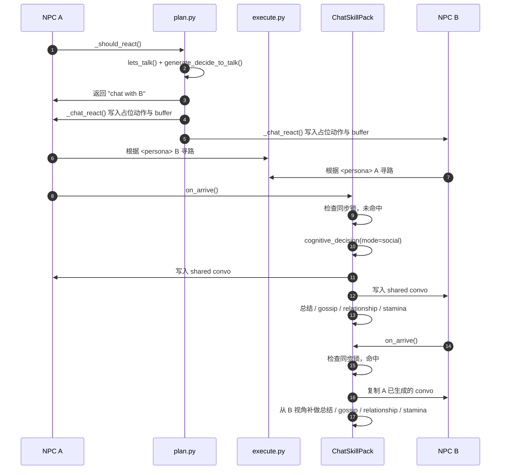

# NPC 之间对话触发与交流过程设计说明

## 1. 文档目标

本文档梳理当前仓库中 NPC 之间开始对话的触发条件、从意图判定到物理执行的调用链、会话生成机制、状态与记忆写回方式，以及实现中的关键约束与潜在风险。

本文聚焦 NPC 与 NPC 的社交对话链路，不展开 Creator 与 NPC 的异步通信链路。

---

## 2. 总体结论

当前 NPC 社交对话采用的是一套典型的“规划期只决定是否聊天，执行期到达后才真正生成对话”的延迟执行架构：

1. 在 `Persona.move()` 的认知循环里，NPC 先感知和检索周围事件。
2. `plan.py` 中 `_should_react()` 判断当前是否应该对另一个 NPC 发起聊天。
3. 如果决定聊天，`_chat_react()` 只给双方插入一个 `having a conversation with ...` 的占位动作，并写入 `chat with` 事件，不在这里生成台词。
4. 双方通过 `execute.py` 寻路接近对方。
5. 某一方先到达后，执行层按 `SKILL_REGISTRY` 将 `chat with` 分发给 `ChatSkillPack.on_arrive()`。
6. `ChatSkillPack` 才会真正调用 LLM 生成 1 轮到多轮对话，并完成总结、八卦提取、关系更新和精力恢复。
7. 后到达的一方不会重复生成一份新对话，而是通过“会话同步锁”复用先到达方已经生成的 `scratch.chat`。

这套设计的核心价值是：

- 避免在 `plan` 阶段提前“预知未来”式地生成会话。
- 避免双方各自独立生成两份不一致的聊天记录。
- 让聊天的物理发生时机、记忆写入和关系变化保持一致。

---

## 3. 主调用链

NPC 社交对话的主链路如下：

```text
Persona.move()
  -> perceive()
  -> retrieve()
  -> plan()
     -> _should_react()
        -> lets_talk()
           -> generate_decide_to_talk()
     -> _chat_react()
        -> _create_react()
           -> scratch.add_new_action()
  -> reflect()
  -> execute()
     -> SKILL_REGISTRY["chat with"]
     -> ChatSkillPack.on_arrive()
        -> cognitive_decision(mode="social")
        -> 写回 scratch / memory / relationship
```

对应关键文件：

- `reverie/backend_server/persona/persona.py`
- `reverie/backend_server/persona/cognitive_modules/plan.py`
- `reverie/backend_server/persona/cognitive_modules/execute.py`
- `reverie/backend_server/persona/cognitive_modules/skill_packs/chat_skill.py`
- `reverie/backend_server/persona/memory_structures/scratch.py`
- `reverie/backend_server/persona/cognitive_modules/perceive.py`
- `reverie/backend_server/persona/cognitive_modules/reflect.py`

---

## 4. 对话触发阶段

### 4.1 触发入口

NPC 每一步都会执行 `Persona.move()` 中的认知主循环：

- `perceive()` 感知周围事件
- `retrieve()` 从记忆里召回相关上下文
- `plan()` 基于感知与记忆决定下一步行为
- `reflect()` 做反思写回
- `execute()` 执行动作或继续寻路

NPC 之间“是否开始对话”的真正判定入口在 `plan.py` 的 `_should_react()`。

### 4.2 `_should_react()` 的判定逻辑

`_should_react(persona, retrieved, personas)` 会读取当前聚焦事件 `curr_event`。当事件主体是另一个 NPC 时，优先尝试走 `lets_talk()`，若不满足，再尝试普通 reaction 逻辑。

也就是说，NPC 社交对话在系统里的优先级高于普通等待/观察类反应。

### 4.3 `lets_talk()` 的硬条件

`lets_talk(init_persona, target_persona, retrieved)` 在调用 LLM 前，先做一组硬约束过滤：

1. 双方都必须已有当前动作地址和动作描述。
2. 双方当前动作都不能包含 `sleeping`。
3. 发起方当前时间不能是 `23` 点。
4. 对方不能处于 `<waiting>` 状态。
5. 双方当前都不能已经在聊天，即 `scratch.chatting_with` 为空。
6. 若对方仍在 `chatting_with_buffer` 冷却期内，则禁止再次发起。

只有通过这些硬过滤后，才会调用 `generate_decide_to_talk(init_persona, target_persona, retrieved)` 让 LLM 做最终意图判断。

如果该函数返回真值，`_should_react()` 就会直接返回：

```text
chat with {target_persona_name}
```

这就是 NPC 社交对话动作被正式注入系统的标志。

---

## 5. 占位规划阶段

### 5.1 `_chat_react()` 的职责

`_chat_react()` 是“把聊天从一个意图变成一个可执行动作”的关键函数，但它本身并不生成任何台词。

它的设计目标是：

- 为双方同时写入一致的聊天占位动作
- 给后续执行层保留统一的 `chat with` 事件语义
- 预先锁定一段聊天时长，保证物理层有一个明确的交互窗口

### 5.2 写入的关键状态

`_chat_react()` 会为发起者和目标 NPC 分别调用 `_create_react()`，而 `_create_react()` 最终调用 `scratch.add_new_action()` 完成状态写入。

对双方写入的核心字段包括：

- `act_description`: `having a conversation with {target}`
- `act_duration`: 固定为 `10` 分钟
- `act_address`: 发起者写成 `<persona> {target}`，目标方写成 `<persona> {initiator}`
- `act_event`: `(self_name, "chat with", other_name)`
- `chatting_with`: 对方名字
- `chatting_end_time`: 当前时刻向上对齐到整分钟后，再加 `10` 分钟
- `chatting_with_buffer`: 给本次对话对象写入 `800`
- `act_pronunciatio`: `💬`

其中 `chatting_with_buffer` 的作用是防止双方刚聊完后立刻再次对聊，形成无限循环。

### 5.3 冷却递减机制

`plan()` 的尾部会在每一步对 `chatting_with_buffer` 做递减处理：

- 如果某个名字不是当前正在聊天对象，则对应 buffer 值减 `1`
- 当 `lets_talk()` 检查到某人的 buffer 仍大于 `0` 时，直接禁止再次发起聊天

因此，这个 buffer 实际上承担了一个“对同一对象的对话冷却计数器”角色。

---

## 6. 寻路与执行分发阶段

### 6.1 为什么聊天不会在 `plan` 阶段直接发生

虽然 `plan()` 已经把聊天意图写入了 `scratch`，但此时双方只是“决定去聊”，并没有真正开始交流。

真正开始交流的前提是：

- 当前动作已经写入 `act_address`
- `execute.py` 已经为该动作算出 `planned_path`
- 至少有一方走完路径并触发“到达”结算

这正是延迟执行设计的核心。

### 6.2 `execute.py` 对 `<persona>` 地址的处理

当 `act_address` 包含 `<persona>` 时，`execute()` 会把目标 NPC 当前所处位置作为目标，调用寻路器找到一条接近对方的路径，并从中选择合适的临近瓦片。

因此，对话动作在执行层表现为：

- 一个有真实寻路过程的人物交互动作
- 而不是原地立刻完成的抽象事件

### 6.3 到达后如何分发到聊天技能包

当 `planned_path` 被消费完，且当前动作路径已建立完成时，`execute.py` 会认为该动作已经“到达可结算状态”，随后：

1. 从 `scratch.act_command` 或 `act_event` 推断 `skill_id`
2. 读取 `SKILL_REGISTRY`
3. 将 `chat with`、`chat`、`talk` 等映射到 `ChatSkillPack`
4. 调用 `skill.on_arrive(persona, target, maze, personas)`

也就是说，聊天真正被执行的时刻，不是做出决策的时候，而是“物理抵达”之后。

---

## 7. 会话生成阶段

### 7.1 `ChatSkillPack.on_arrive()` 是真正的开始交流入口

NPC 之间的聊天内容，不是在 `plan.py` 里生成，而是在 `chat_skill.py` 的 `ChatSkillPack.on_arrive()` 中生成。

这个函数分成两条路径：

1. 同步锁命中：复用对方已生成的会话
2. 同步锁未命中：自己成为本次对话的主生成者

### 7.2 会话同步锁

`on_arrive()` 一开始会检查：

- 目标对象是否存在于 `personas`
- `target_p.scratch.chatting_with == persona.name`
- `target_p.scratch.chat` 是否已经存在

如果这三个条件成立，说明对方已经先到达并生成了本次对话。

此时当前 NPC 不再重复调用 LLM，而是直接：

- 复制 `target_p.scratch.chat`
- 更新自己的 `scratch.chat`
- 更新自己的 `chatting_with`
- 根据复制来的会话倒序提取自己的 `last_chat`
- 从自己的视角独立生成对话总结
- 独立提取自己从对话中学到的 gossip
- 更新双方关系图谱
- 恢复自身精力

这个机制保证了：

- 同一场对话只生成一份共享 `convo`
- 但每个 NPC 仍然保留自己的主观理解和记忆沉淀

### 7.3 `cognitive_decision()` 的 social 分支

如果同步锁未命中，先到达的一方会进入 `cognitive_decision()` 的 social 分支。

这一分支的核心行为是：

1. 确认对方 NPC 存在。
2. 构造当前见面场景 `curr_context`。
3. 初始化空的 `convo`。
4. 让双方轮流充当 `speaker` 和 `listener`。
5. 最多执行 `4` 轮对话生成。

每轮生成时会做三类上下文拼装：

- 检索记忆：`new_retrieve(speaker, [listener.name, "news", "rumor", "town"], 10)`
- 历史对话：将当前 `convo` 拼成文本
- 社交关系：从 `speaker.a_mem.get_relationship(listener.name)` 中注入关系状态、信任度和近期互动

然后将这些内容填入 Prompt 模板：

- `persona/prompt_template/v2/social_chat_gossip_v1.txt`

Prompt 约束模型输出一个 JSON：

```json
{
  "utterance": "下一句中文台词",
  "end": false,
  "reasoning": "本轮说话策略"
}
```

系统只要拿到 `utterance` 和 `end`，就会把该轮结果 append 到 `convo` 中；若 `end=true`，则提前结束整场聊天。

### 7.4 当前会话生成策略的设计特点

当前 social chat 不是闲聊模板硬编码，而是一个“关系驱动 + 记忆驱动 + 八卦传播导向”的生成器：

- 说什么，主要受记忆检索结果影响
- 说给谁，受对方身份与关系图谱影响
- 是否继续聊，受本轮 `end` 决策影响
- 聊天结果天然为 rumor/gossip 传播提供素材

因此它不是一个单纯的 UI 对话系统，而是整个社会关系与记忆传播机制的一部分。

---

## 8. 结算与状态写回

### 8.1 对双方 `scratch` 的写回

当主生成者完成 social conversation 后，`on_arrive()` 会写回：

- `persona.scratch.chat = convo`
- `target_p.scratch.chat = convo`
- `persona.scratch.chatting_with = target_p_name`
- `target_p.scratch.chatting_with = persona.name`
- 双方 `act_pronunciatio = "💬"`

随后还会从 `convo` 末尾倒序回溯，分别抽取双方最近一句自己的台词，写入：

- `persona.scratch.last_chat`
- `target_p.scratch.last_chat`

### 8.2 对话摘要记忆

当前实现里，每个 NPC 都会在自己到达结算时，从自己的视角为这段对话生成一份总结，并写入 `AssociativeMemory.add_event(...)`。

摘要文本默认是：

```text
{A} and {B} talked about recent topics and shared town gossip.
```

如果 `run_gpt_prompt_summarize_conversation(...)` 可用，则会改用 LLM 生成的总结文本。

这意味着：

- 共享的是原始 `convo`
- 独立的是“我如何理解这场聊天”

### 8.3 Gossip 提取

每个到达结算的 NPC 都会再次对完整对话文本发起一次 gossip 提取：

- 输入：完整 `convo`
- 输出：一句中文总结，描述“我从对话中听到了什么关于他人或事件的消息”

如果结果不是 `none`，系统会写入一条类似：

```text
{persona.name} heard that {gossip_cleaned}
```

的事件记忆。

这使得聊天不仅是社交表现，还承担了知识扩散与世界认知传播功能。

### 8.4 关系更新

聊天完成后，系统会调用双方的：

- `a_mem.update_relationship(...)`

当前实现的默认效果是：

- 若此前没有关系，则初始化为 `friend`
- 每次聊天给 `trust_delta=0.05`
- 把对话总结写入 `recent_event`

因此，NPC 社交对话会持续重塑关系图谱，而不是纯展示型交互。

### 8.5 生理恢复

每个参与者在自己的到达结算阶段，都会获得一次社交恢复：

- `stamina = min(100.0, stamina + 15.0)`

这说明聊天在当前系统中是一个带有明确代谢收益的行为。

---

## 9. 记忆沉淀的后续链路

### 9.1 `perceive.py` 对完整聊天记录的写入

当 NPC 在感知阶段观察到“自己正在执行 `chat with` 事件”时，`perceive.py` 会调用：

- `a_mem.add_chat(...)`

把当前 `scratch.chat` 整段完整聊天记录作为 chat node 写入记忆流。

因此，事件摘要和完整聊天记录是两层不同粒度的记忆：

- `add_event(...)` 负责摘要化事件
- `add_chat(...)` 负责完整对话文本

### 9.2 `reflect.py` 的对话反思

在后续反思阶段，如果命中 `chatting_end_time` 相关条件，`reflect.py` 会基于最近一次聊天生成两类 thought：

- `planning_thought_on_convo`
- `memo_on_convo`

并通过 `a_mem.add_thought(...)` 写入长期思维记忆。

因此，一场聊天的影响链不止于当下：

```text
对话发生
  -> 写入 chat / event / gossip
  -> 进入后续检索
  -> 触发 reflect 生成高层 thought
  -> 影响未来规划与关系判断
```

---

## 10. 时序图



---

## 11. 设计优点

### 11.1 避免计划期过载

`plan.py` 只做“要不要聊”的轻量决策，不承担完整台词生成，减少了规划阶段的耦合与前置开销。

### 11.2 保证物理时序一致

必须先移动、再到达、再开聊，符合仿真世界中的时间顺序。

### 11.3 避免双份会话

同步锁机制保证大多数情况下只会有一方生成实际对话，另一方复用结果，避免冲突。

### 11.4 让聊天成为社会系统的一部分

聊天不是独立功能，而是关系更新、八卦传播、反思生成和后续规划的重要上游事件。

---

## 12. 当前实现中的约束与潜在风险

### 12.1 触发前提较硬

当前 `lets_talk()` 对时间、睡眠、等待状态、当前是否在聊天、冷却 buffer 等限制较多。它能防止异常状态下乱聊，但也可能让部分本可自然发生的社交互动被硬过滤掉。

### 12.2 冷却 buffer 是计数型，不是语义型

`chatting_with_buffer` 只是简单的数值递减机制。它能防止死循环，但并不能表达“虽然刚聊过，但因为出现新事件应该再次沟通”这类更细腻的社交语义。

### 12.3 先到者决定整场共享会话

当前共享 `convo` 由先到达者主导生成，后到达者直接复用。这避免了重复生成，但也意味着整场会话在语言风格、话题走向上会更偏向先到者的认知状态。

### 12.4 反思触发条件较脆弱

`reflect.py` 当前使用 `curr_time + 10 seconds == chatting_end_time` 这一严格条件来触发对话反思写入。这个判定依赖时钟步进对齐，非常容易因为时间粒度或状态更新顺序变化而错过反思节点。

### 12.5 记忆写入是分阶段完成的

完整聊天记录、事件摘要、gossip、relationship、thought 不是一次性同时写完，而是分散在 `chat_skill.py`、`perceive.py`、`reflect.py` 三个阶段。这种设计很灵活，但排查“为什么某条聊天没有完整沉淀”时需要跨模块追踪。

---

## 13. 后续优化建议

如果后续要继续增强 NPC 社交系统，优先建议关注以下方向：

1. 将 `lets_talk()` 从纯硬过滤升级为“硬过滤 + 自然语言社交动机”混合判定。
2. 把 `chatting_with_buffer` 从固定倒计时，升级为可结合事件新鲜度和关系紧急度的动态冷却。
3. 将 `reflect.py` 的对话反思触发，从严格时间相等改成更稳健的区间判定或显式事件驱动。
4. 给社交对话增加更明确的话题类型标签，例如安慰、闲聊、交换情报、协作通知。
5. 增强双边视角建模，让后到达方在复用共享 `convo` 的同时，也能补充一层自己的隐性解读或回应偏置。

---

## 14. 一句话总结

当前 NPC 与 NPC 对话系统的本质，是一条以 `plan.py` 做意图触发、以 `execute.py` 做物理到达分发、以 `ChatSkillPack` 做会话生成与社会性结算、以 `perceive/reflect` 做长期记忆沉淀的完整社交行为链路。
