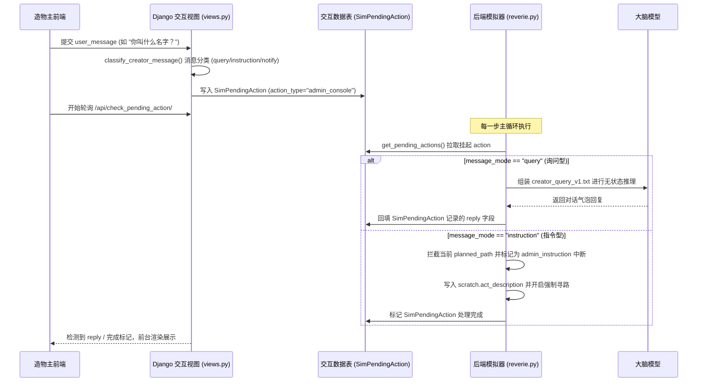

# Generative Agents — 开发者手册与命令操作指南

本文档汇集了智能体模拟器日常操作命令、大模型与 Prompt 参数配置、新技能（Skill）整合自查清单、地图与碰撞 Patch 指南，以及造物主（Creator）管理后台的交互开发流程。

---

## 目录
1. [模拟器命令行（CLI）操作速查](#1-模拟器命令行cli操作速查)
2. [大模型路由与 Prompt 配置指南](#2-大模型路由与-prompt-配置指南)
3. [新技能（Skill Pack）集成自查清单](#3-新技能skill-pack集成自查清单)
4. [小镇地图补点与碰撞 Patch 指南](#4-小镇地图补点与碰撞-patch-指南)
5. [造物主后台（Admin Console）与 NPC 交互流程](#5-造物主后台admin-console与-npc-交互流程)

---

## 1. 模拟器命令行（CLI）操作速查

运行智能体模拟器后端服务 `reverie.py` 时，在交互式命令行提示符 `Enter option: ` 处可以使用的核心指令：

### 1.1 进程与进度控制
*   `save`：保存当前的模拟进度。进度会被写入 `environment/frontend_server/storage/<sim-name>` 目录。
*   `fin` / `f` / `finish` / `save and finish`：保存当前的模拟进度，并**安全退出**模拟器（推荐）。
*   `exit`：**直接退出**模拟器而不保存。**警告**：该操作会**彻底删除**当前运行产生的所有临时和进度数据。

### 1.2 模拟运行与初始化
*   `run <step-count>`：向前运行指定步数的模拟。每一游戏步代表游戏内时间 **10 秒**（如 `run 100` 代表模拟 1000 秒，约 16.7 分钟）。
*   `call -- load history the_ville/<file_name>.csv`：在启动阶段为所有智能体批量加载初始历史。必须在模拟刚启动且处于交互命令行时输入。配置文件需存放在 `environment/frontend_server/static_dirs/assets/the_ville/` 目录下。

### 1.3 智能体（Persona）状态探测
*   `print persona schedule <Persona Name>`：打印智能体已被拆解后的**今日日程表摘要**。
*   `print all persona schedule`：打印当前世界中**所有**智能体的今日日程表摘要。
*   `print hourly org persona schedule <Persona Name>`：打印智能体原始的、每小时计划的日程安排表（未细化拆解版）。
*   `print persona current tile <Persona Name>`：打印智能体当前在地图上的瓦片坐标 `(x, y)`。
*   `print persona chatting with buffer <Persona Name>`：打印智能体与其他智能体的聊天缓冲状态。
*   `print persona associative memory (event / thought / chat) <Persona Name>`：打印智能体关联记忆流中的所有事件、反思（想法）或对话历史记录序列。
*   `print persona spatial memory <Persona Name>`：以树状结构输出该智能体脑海中的**空间记忆树**。
*   `call -- analysis <Persona Name>`：启动与指定智能体的**无状态交互会话**。用于调试，向智能体提问但内容不会存入记忆流中。

### 1.4 地图与环境查询
*   `print current time`：打印模拟当前时间与已走的总步数。
*   `print tile event <x>, <y>`：打印指定坐标瓦片上正在发生的所有事件描述（逗号分隔）。
*   `print tile details <x>, <y>`：打印指定坐标瓦片的详细物理信息，如阻挡状态、所属房间、包含的家具等。

---

## 2. 大模型路由与 Prompt 配置指南

项目目前采用“任务类型 $\rightarrow$ 配置名 $\rightarrow$ 实际模型”的中心化路由架构，所有的任务路由及 API 密钥配置均集中在以下文件中管理：
*   **主配置文件**：`reverie/backend_server/llm_api_config.py`

### 2.1 任务路由与模型映射总表
系统支持的配置池（可用模型）包括 `local`（本地 Ollama 运行的 `qwen2.5:7b`）、`zhipu_chat`（智谱云端的 `glm-4-flash`）、`deepseek_chat`（DeepSeek 云端的 `deepseek-chat`）等。
当业务代码调用 `get_task_route_request_config(task_type)` 时，配置中心按任务类型动态获取最终配置字典：

| 任务类型 (`task_type`) | 默认路由配置名 | 实际模型 / API 实例 |
| :--- | :---: | :--- |
| `joint_decision` | `zhipu_chat` | `glm-4-flash` |
| `demand_thinking` | `zhipu_chat` | `glm-4-flash` |
| `action_translation` | `zhipu_chat` | `glm-4-flash` |
| `action_outcome` | `zhipu_chat` | `glm-4-flash` |
| `chat_conversation` | `zhipu_chat` | `glm-4-flash` |
| `motive_selection` | `zhipu_chat` | `glm-4-flash` |
| `social_obligation` | `zhipu_chat` | `glm-4-flash` |
| `insight_generation` | `zhipu_chat` | `glm-4-flash` |
| `embedding` | `local` | `nomic-embed-text`（Ollama 本地） |

### 2.2 本地 Ollama 部署与配置修改
1.  **启动 Ollama**：在 macOS 上可以通过 `start_macos.command` 自动启动或拉取模型，Ollama 默认运行在本地端口 `11434`。
2.  **切换任务模型**：如需将决策任务改为本地 DeepSeek 推理，只需在 `llm_api_config.py` 的 `TASK_ROUTE_CONFIG_NAMES` 中修改对应任务类型的映射指向即可：
    ```python
    TASK_ROUTE_CONFIG_NAMES = {
        "joint_decision": "local_deepseek",  # 指向本地 deepseek-r1:7b 配置
        ...
    }
    ```

### 2.3 决策纠错重试机制配置
在决策物理可行性校验失败时，决策引擎支持自动向 LLM 发起纠错重试：
*   **重试次数配置**：重试预算上限由全局参数 `LLM_CORRECTION_MAX_RETRIES` 控制（在 `reverie/backend_server/persona/cognitive_modules/plan.py` 中定义）。
*   **有效值范围**：默认为 `0` 到 `3` 次。设为 `0` 时关闭纠错重试，校验失败直接 fallback 到 `Idle`；设为大于 `0` 的值可开启自主纠错闭环。

---

## 3. 新技能（Skill Pack）集成自查清单

当在项目内新增一个物理技能（如 `exercise`、`read`）或者重构一个旧有的动作时，必须完成以下各层注册，以确保动作链路闭环：

### 3.1 物理层：SkillPack 注册
- [ ] 在 `reverie/backend_server/persona/cognitive_modules/skill_packs/` 下新建具体的技能文件（如 `exercise_skill.py`），继承自 `BaseSkillPack` 并实现 `can_execute` 和 `on_arrive` 接口。
- [ ] 在 `reverie/backend_server/persona/cognitive_modules/skill_packs/__init__.py` 的 `SKILL_REGISTRY` 字典中注册该技能类。注册的 Key（通常为小写）必须与执行层最终路由获取的 `skill_id` 严格保持一致。

### 3.2 解析层：动作归一化与别名转换
- [ ] 在 `action_command_utils.py` 的 `normalize_skill_id()` 中，增加对大模型生成的原始动作词（如 `work out`、`lifting weight`、`doing exercise`）的别名映射，将其归一化为标准的内部 `skill_id`（如 `exercise`）。
- [ ] 如果该技能在 `Consume` 或 `Rest` 执行时有特定的语法修正（如把“床铺上的 gather 动作”修正为 `rest`），在此处添加对应的上下文检查规则。

### 3.3 意图层：动机与物理结算绑定
- [ ] 在 `action_command_utils.py` 的 `infer_intent_family()` 函数中，为该技能的 `skill_id` 和对应目标物体注册意图家族（`intent_family`）。例如 `exercise` 对应 `restore_mood` 或 `leisure`。
- [ ] 若该意图家族代表智能体的一个核心主动机需求，需要在 `plan.py` 中的 `_dominant_motive_from_intent_family()` 增加双向转换绑定，确保执行层能够向主动机更新反馈。
- [ ] 在具体 `SkillPack.on_arrive()` 结算逻辑的最后，调用 `apply_declared_base_state_effects` 与 `apply_declared_motive_effects` 修改生理和心理动机数值，使行为结果反馈给状态层。

### 3.4 决策层：Prompt 模板更新
- [ ] 将新动作归类添加至大模型可见的 `reverie/backend_server/persona/prompt_template/v2/action_schema.json` 规则文档中。
- [ ] 更新 `run_gpt_prompt.py` 中动作翻译验证的 Allowlists 列表，防止动作翻译引擎在后置格式校验中拦截并过滤该新动作。
- [ ] 确保新决策模板输出中正确包含了长期策略字段：在决策 Prompt 中需要返回 `strategic_intent`、`expected_followup` 和 `risk` 三个策略属性。
- [ ] 检查并确保新增的动作目标遵循自指目标限制 `self_target_forbidden=true`，任何情况下行动者均不可将自己作为目标。

---

## 4. 小镇地图补点与碰撞 Patch 指南

小镇理论骨架由底图静态定义（CSV 物理瓦片），但智能体实际能交互的范围由脑海中的空间认知记忆树决定。补充或修正一个地图可交互对象（如厨房炉灶、苹果树）的技术方案如下：

### 4.1 地图补点三种模式
*   **模式 A：静态底图已经存在，角色脑海中无认知**
    *   *特征*：底图 CSV 已有数据，但小人的 `spatial_memory.json` 缺少该 KV 层级。
    *   *操作*：无需更改底图文件。直接打开角色 bootstrap 目录下的 `personas/<name>/bootstrap_memory/spatial_memory.json`，在对应的 sector $\rightarrow$ arena $\rightarrow$ object 字典树下追加该物体的标准英文名称即可。
*   **模式 B：物体类型存在，但静态底图瓦片未挂载**
    *   *特征*：该物体类型已在系统注册，但需要将其铺设到小镇某个物理瓦片坐标上。
    *   *操作*：修改 `environment/frontend_server/static_dirs/assets/the_ville/matrix/game_object_blocks.csv`，在目标坐标 `(x, y)` 行填入物体名称。然后再把该名称写入小人的 `spatial_memory.json`。
*   **模式 C：完全新增小镇不曾拥有的全新物体类型**
    *   *特征*：如完全新增苹果树（`apple_tree`）这一交互类型。
    *   *操作*：
        1. 在 `game_object_blocks.csv` 中挑选闲置地块坐标填入新类型（如 `apple_tree`）。
        2. 将 `apple_tree` 写入角色的 `spatial_memory.json`。
        3. 在 `reverie/backend_server/maze.py` 内部物品白名单中注册该类型并标记是否为食物产出源。

---

## 5. 造物主后台（Admin Console）与 NPC 交互流程

管理员/造物主通过网页 `admin/` 控制台与 NPC 交互时，数据包的底层交互链路如下：



### 5.1 消息分类原则
*   **询问型消息 (`query`)**：包含“什么”、“哪里”等疑问词或以疑问标点（`?` / `？`）结尾的消息。系统会通过大模型进行无状态回答，不产生物理位置转移，**回答不会写入 NPC 的记忆流**。
*   **指令型消息 (`instruction`)**：直接要求智能体移动或改变行为（如“去吃苹果”）。系统会清除 NPC 当前动作和 planned_path，触发 `admin_instruction` 中断，把指令写入 Scratch 并强制寻路执行。**指令的物理结算后果会写入 NPC 记忆流**。
*   **通知型消息 (`notify`)**：对 NPC 广播环境通知（如“外面下大雨了”）。这会直接转换为一段感知事件，塞入 `ConceptNode` 作为 NPC 下一步决策的背景记忆。
