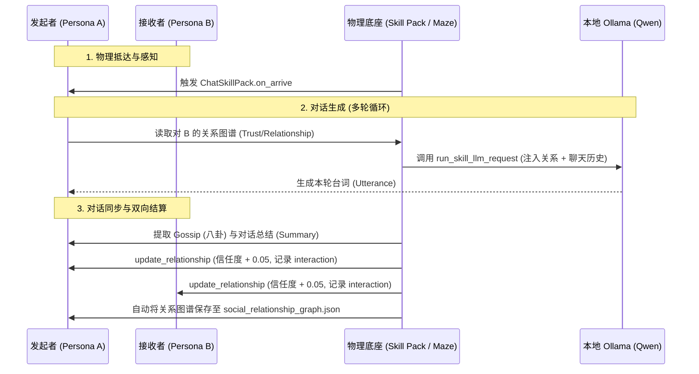

# 理性化游戏智能体技能与社交关系图谱设计报告

针对游戏智能体（Game Agent）开发中“每次需要自带长提示词与无记忆大模型交互、理性不足、Token 浪费”的痛点，本项目通过**重构技能包（Skill Packs）接口**并**集成社会关系图谱**，实现了一套高内聚、低延迟的“快慢思考”双系统智能体架构。

本文档详细说明本套方案的设计思路与使用方法。

---

## 1. 核心设计思路

### 1) 行为“去特化”与双系统认知架构
为了防止大模型在日常琐碎行为中造成不必要的 Token 消耗与推理延迟，我们将 NPC 的决策解耦为两层：
*   **系统 1 (快思考 / 物理底座)**：NPC 的高频生理代谢动作（如“休息”恢复精力，或“吃苹果”恢复饱食度）。一旦大模型在外层规划了此项动作，物理底座代码直接在 `on_arrive` 结算处修改角色属性，**零大模型开销**。
*   **系统 2 (慢思考 / 技能认知)**：只有需要主观变数的行为（如“选择食谱烹饪”或“多轮社交对话”），才会在到达目的地后触发 `cognitive_decision` 方法，针对性地调用微型大模型。

### 2) 统一接口管理与 Prompt Caching
在 `BaseSkillPack` 中抽象出统一的 `run_skill_llm_request` 接口。
*   **收口控制**：所有的微型 LLM 调用集中收口，便于后续引入统一的错误重试、延迟监控和并发管理。
*   **Ollama 缓存优化**：将 Prompt 严格划分为“静态缓存段（系统人设、关系图谱）”与“动态变化段（聊天历史、最新一句话）”，保证了本地大模型可以在多轮交互中命中 **Prompt Caching (KV Cache)**，首字相应时间由数秒降至毫秒级。

### 3) 语义图谱替代纯向量检索 (RAG)
直接用向量相似度召回的记忆片段是零散且无序的。我们引入了**“社会关系图谱 (Social Relationship Graph)”**：
*   为每个 NPC 的 `AssociativeMemory` 绑定一个持久化的图结构 JSON，记录对其他角色的 **关系类型 (relationship)**、**信任度 (trust)** 和 **最近的互动总结 (recent_events)**。
*   在生成台词时，图谱约束直接注入到 Context 中，NPC 无需每次都去做“人际关系概括”的 LLM 推理，即可在谈吐中表现出连续的一致态度。

---

## 2. 架构与数据流

本系统在执行社交对话（Chat Skill）时的生命周期数据流如下：



---

## 3. 使用与开发方法

### 1) 如何在开发新的 Skill 时调用统一大模型接口

当你继承 `BaseSkillPack` 编写新的技能时，可以在 `cognitive_decision` 方法中直接调用 `self.run_skill_llm_request`：

```python
from persona.cognitive_modules.skill_packs.base import BaseSkillPack

class MyNewSkillPack(BaseSkillPack):
    def __init__(self):
        super().__init__()
        self.name = "my_skill"
        self.associated_xp = "intellect"

    def cognitive_decision(self, persona, target, maze, personas) -> dict:
        # 1. 构造聚焦的 Prompt 
        prompt = f"你正在执行 {self.name}。当前目标是 {target}。做出你的下一步选择。"
        example_output = '{"choice": "continue", "thought": "I should proceed."}'
        special_instruction = "Respond only in valid JSON."
        
        # 2. 调用统一收口接口
        decision = self.run_skill_llm_request(
            prompt, 
            example_output, 
            special_instruction,
            fail_safe_response={"choice": "stop", "thought": "Error fallback"},
            repeat=2
        )
        return decision
```

### 2) 如何读写社会关系图谱 (API 调用)

社会关系图谱已经作为辅助文件集成在 `AssociativeMemory` 内部。在拥有 `persona` 对象的任何模块中，你都可以使用以下 API：

#### A. 获取对方与自己的关系状态
```python
# 获取 persona 视角下，对 Klaus Mueller 的认知关系
relationship_data = persona.a_mem.get_relationship("Klaus Mueller")

if relationship_data:
    relation_type = relationship_data["relationship"]  # e.g., "friend"
    trust_level = relationship_data["trust"]          # e.g., 0.75
    recent_events = relationship_data["recent_events"]  # e.g., ["一起喝咖啡", "借了物理书"]
```

#### B. 动态更新关系图谱
当你完成了一次成功的交互、产生冲突或接受了对方的馈赠，直接进行增量更新：
```python
# 1. 增量提升信任度 (trust_delta)，并向互动队列追加最近的事件
persona.a_mem.update_relationship(
    target_name="Maria Lopez",
    trust_delta=0.05,
    recent_event="Maria López 帮我解答了物理题"
)

# 2. 改变关系身份类别，或强制设定绝对信任值 (trust_absolute)
persona.a_mem.update_relationship(
    target_name="Maria Lopez",
    relation_type="best_friend",
    trust_absolute=0.95
)
```

#### C. 数据自动落地
你不需要手动进行文件写入。当游戏主循环（如在 `reverie.py` 中）触发保存 `persona.save(save_folder)` 时，`social_relationship_graph.json` 就会被自动序列化并存储至 `personas/<name>/bootstrap_memory/associative_memory` 文件夹下，并在下一次启动模拟时自动恢复。
