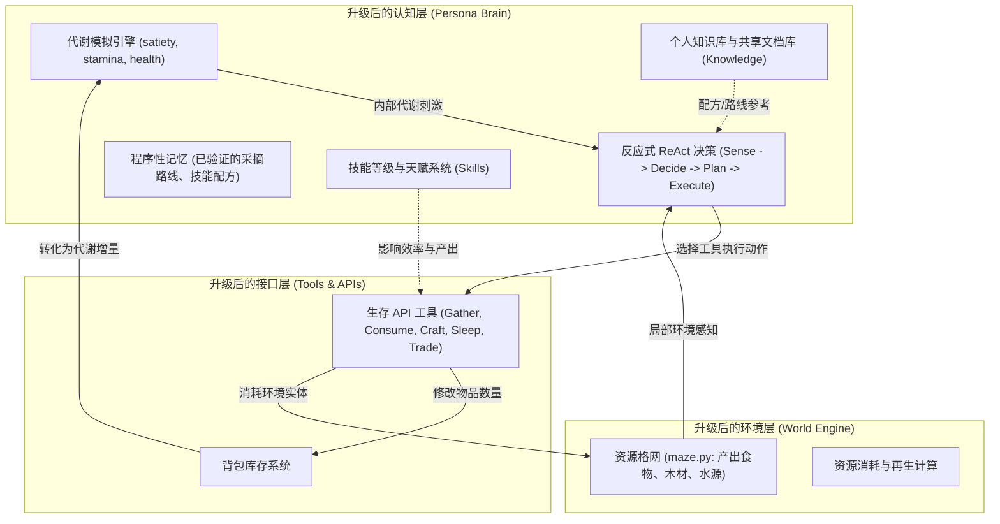

# Generative Agents — 生存与进化系统架构设计方案

为了实现“让 Agent 在全要素虚拟环境中生存进化”的目标，本项目需要从现有的**社交沙盒模拟器（纯文本驱动的日常行为描述）**，重构并演进为**代谢与演化沙盒（生理数值驱动的生存反馈回路）**。

本文档基于对当前项目架构（参见 [core_architecture_guide.md](file:///g:/generative_agents/docs/core_architecture_guide.md) 与 [codebase_analysis.md](file:///g:/generative_agents/docs/codebase_analysis.md)）的分析，结合最新的 Agent 智能体概念（ReAct 循环、自主工具调用、多级记忆系统），提出了完整的系统重构方案。

---

## 1. 核心瓶颈与重构目标对比

| 维度 | 当前实现 (Current Sandbox) | 重构目标 (Survival & Evolution Sandbox) |
| :--- | :--- | :--- |
| **行为驱动力 (Motivation)** | 完全由文本日常习惯决定。智能体睡觉/吃饭是因为 `lifestyle` 文本模版里有这句设定，而非由于生理需要。 | **代谢稳态 (Homeostasis)**：引入数值化的生理指标（饥饿值、精力值、生命值）作为底层驱动力，指标越低触发的生存渴望越迫切。 |
| **环境要素 (Environment)** | 静态的 2D 坐标网格。家具和建筑只是坐标地址，不携带资源属性。Agent 进行“吃饭”只是移动到特定网格，不消耗任何实际物理资源。 | **全要素动态资源网格**：地图瓦片包含可采集/消耗的资源（食物、水源、矿产等），具备消耗递减与随时间自然再生的物理机制。 |
| **动作执行 (Execution)** | 动作是 free-form 自然语言文本（如 "cooking"），经过 LLM 解析为坐标和简单的事件三元组。 | **工具化/API 化的生存动作**：引入具体的工具函数 API（`Gather` 采集、`Consume` 消耗、`Craft` 合成、`Rest` 休息、`Trade` 交易），执行动作会产生代谢和背包物品状态的改变。 |
| **知识与技能 (Knowledge & Skills)** | 无独立且结构化的知识体系与技能成长指标，仅依赖通用的 Associative Memory 做扁平记录。 | **结构化知识库与技能熟练度**：划分个人知识/共享文档（如生存手册、合成配方），引入升级式的职业技能（烹饪、农业、制造等）与特殊天赋技能。 |
| **认知决策循环 (Cognitive Loop)** | 醒来时规划一天的粗日程，随时间逐步细化，在路上移动时倾向于跳过 LLM 决策。 | **实时反应式 ReAct (Reasoning + Acting) 决策流**：持续监控内部生理状况与环境危害（天气、温度），一旦生理数值跌破警戒线，立即打断现有日程并重新规划。 |
| **进化机制 (Evolution)** | 反思（Reflection）仅用于提炼高层次的 Thoughts（对社交关系的认识），不改变其底层生存技能与行为决策。 | **认知与策略演化**：在 Reflection 阶段分析生存状况的优劣，结合技能提升与知识学习更新“程序性记忆（Procedural Memory）”，并允许 Agent 在社交中相互传播。 |

---

## 2. 系统重构后架构与数据流

重构后的系统分为三个协同升级的层级：

### 2.1 升级工作记忆 [scratch.py](file:///g:/generative_agents/reverie/backend_server/persona/memory_structures/scratch.py) 引入生理与背包系统
在 `Scratch` 类中新增成员变量，维持智能体的代谢稳态：
* **代谢属性 (Homeostatic States)**：
  * `satiety` (饱食度，0-100)：每个时间步根据活动强度扣减。当为 0 时开始每步扣减 `health`。
  * `stamina` (精力值，0-100)：执行体力劳动（如采集）时消耗，睡眠或休息时恢复。
  * `health` (生命值，0-100)：物理生存极限，降为 0 时智能体判定为死亡。
* **背包库存 (Inventory)**：
  * 使用字典结构记录所携带的生存物资，如：`{"apple": 3, "clean_water": 2, "wood": 10}`。

### 2.2 升级小镇地图 [maze.py](file:///g:/generative_agents/reverie/backend_server/maze.py) 引入动态要素
小镇瓦片不再仅仅是障碍物和寻路节点，而具有物理状态：
* **资源图层 (Resource Layer)**：标记特定坐标为资源点（如苹果树、淡水湖、野生灌木）。
* **资源状态机 (Resource Recovery)**：
  * 每次 `Gather` 会使资源点的储量扣减（例如：`apple_tree.apples -= 1`）。
  * 引入全局自然增长逻辑：当储量小于最大值时，每过 N 个步长自动生成或增长资源。
* **环境压力 (Environmental Hazards)**：
  * 引入环境温度、昼夜交替及随机天气（如大雨、酷暑）。环境恶劣度会加速精力或饱食度的流失。

### 2.3 重构认知模块为“反应式生存决策”
将现有的 [plan.py](file:///g:/generative_agents/reverie/backend_server/persona/cognitive_modules/plan.py) 和 [execute.py](file:///g:/generative_agents/reverie/backend_server/persona/cognitive_modules/execute.py) 结合最新的 **ReAct 架构**进行改造：
1.  **感知 (Perceive)**：在感知阶段，Agent 不仅扫描周围的实体（如 Klaus 正在看电视），还要读取自身的生理数据（如自己的 Satiety 跌到了 15）。
2.  **自我评估 (Self-Check)**：如果生理指标低于“危险阈值”（Satiety < 20 或 Health < 30），则触发**计划打断 (Plan Interruption)**。
3.  **生存抉择与规划**：
    * 暂停现有的日常活动计划（如 "writing a book"）。
    * 调用 GPT 模块评估生存方案（去附近的苹果树采集苹果，还是向邻居 Isabella 交易食物？）。
    * 向 `planned_path` 注入生存目标的寻路坐标。
4.  **工具调用**：智能体到达资源点后，不只输出文本，而是调用对应的动作 API：
    * `execute_gather(target_tile)`：采集资源并存入 Inventory。
    * `execute_consume(item)`：消耗 Inventory 中的物资，增加 Satiety 或 Health。

### 2.4 知识库（Knowledge Base）与技能体系（Skill System）设计
为了使智能体不仅仅是简单求生，而是具备“智慧与成长”的能力，引入如下子系统：

#### 1. 结构化知识库 (Knowledge Base)
知识是智能体生存沉淀和学习的载体，保存在 [Scratch](file:///g:/generative_agents/reverie/backend_server/persona/memory_structures/scratch.py) 并在联想记忆中构建索引：
*   **个人知识库 (Personal Knowledge)**：
    *   以结构化 KV 字典和语义向量双重存储。例如保存已知的 `{"safest_routes": {"night": "Main Street"}, "crafting_recipes": {"medicine": ["herb_A", "clean_water"]}}`。
    *   智能体通过自我探索或他人传授，将新发现的物理规律、合成配方等事实录入其中，决策时可检索以指导行动。
*   **文档与读写系统 (Document Library)**：
    *   环境或储物箱中可存放文字书籍/文档（如《小镇植物图鉴》、《农作物种植指南》）。
    *   智能体可执行 `Read` 工具读取外部文档，解析其核心规则存入个人知识库；也可以执行 `Write` 工具撰写自己的“生存手记”或“贸易规则”，将其分享或遗留给其他智能体，实现跨个体的知识遗传。

#### 2. 技能体系 (Skill System)
技能代表智能体解决具体物理问题的“熟练度”与“天赋”，数值化存储在 `Scratch` 中，并直接在 LLM 的 ISS 提示词中体现：
*   **职业技能 (Vocational Skills)**：
    *   具有等级（Level 1-10）与熟练度（XP）。
    *   *Farming (农业)*：影响种植作物的成长速度、免灾率和单次采集产量。
    *   *Cooking (烹饪)*：高等级烹饪能将普通食材制成高能量食物，消除潜在的食物中毒风险（Satiety/Health 恢复效率倍增）。
    *   *Crafting (制造)*：影响制作工具（如斧头、防寒衣）的成功率及成品的耐久度。
    *   *Medicine (医疗)*：影响草药的合成效果，提高对疾病和中毒的治疗速度。
*   **特殊技能/天赋 (Special Skills & Perks)**：
    *   通过达成特定成就或反思后概率习得的被动特质。
    *   *御寒体质 (Cold Resistant)*：在雪天或夜晚低温时，精力消耗率降低 30%。
    *   *交易大师 (Barter Master)*：与他人贸易时，能获得 10% 的价格优惠或说服力加成。
*   **升级与影响机制**：
    *   每次执行 `Gather`、`Craft` 等动作，根据动作难度获得对应的技能 XP。
    *   技能等级提升后，智能体的核心 ISS（Identity Stable Set）中会注入如 *"Klaus is an Expert (Lv.5) Blacksmith"* 描述，使大模型进行决策或对话时展现出专业人士的人设与偏好。

---

## 3. 进化机制设计 (Survival-driven Evolution)

智能体在虚拟环境中的“进化”体现在**个体认知的自适应优化**、**技能的成长累积**与**社会层面的知识传递**。

### 3.1 个体认知的适应性演进与技能成长 (Cognitive & Skill Evolution)
*   **策略与技能自学**：在反思阶段 [reflect.py](file:///g:/generative_agents/reverie/backend_server/persona/cognitive_modules/reflect.py) 中，当 Agent 检测到近期的成功求生事件（如通过配方成功解毒），或技能等级提升，LLM 会将这一经验巩固为“程序性知识”，并升级其职业属性设定。
*   **Traits 动态演化**：长期受到饥饿和恶劣环境折磨 of Agent，其 `Traits`（先天/后天特质）由大模型在反思阶段进行动态更新。例如从最初的 *"懒散、随性"* 进化为 *"谨慎、勤奋的食物收集者"*，甚至因掌握高超的制药技能而获得 *"社区神医"* 的称号。

### 3.2 社会层面的策略传承与技术积累 (Social Evolution)
*   **知识与技能传授**：在社交对话 [converse.py](file:///g:/generative_agents/reverie/backend_server/persona/cognitive_modules/converse.py) 中，高技能或高知识储备的 Agent 可以传授配方或生存常识给低等级 Agent，后者接受后会增加对应技能的初始 XP 或将配方加入个人知识库。
*   **书籍文档传承**：Agent 撰写的文档或日记被放置在图书馆或遗留在小镇中，后代或其他 Agent 可以通过 `Read` 获取这些知识，实现知识的代际遗传与技术积累。
*   **协作与贸易**：由于技能分化（例如 A 擅长种田，B 擅长烹饪，C 擅长制药），智能体之间可自发进行资源交换与劳动分工，通过对话协议确定兑换价格，在小镇中演化出以生存物资为基础的原始经济体系。

---

## 4. 实施阶段与路线图 (Implementation Roadmap)

为了保证开发过程的渐进和稳定，重构应当分阶段执行：

*   **Phase 1：基础代谢与背包状态存储（物理骨架）**
    *   在 [scratch.py](file:///g:/generative_agents/reverie/backend_server/persona/memory_structures/scratch.py) 中定义 `satiety`、`stamina`、`health` 和 `inventory`。
    *   在主时钟循环 [reverie.py](file:///g:/generative_agents/reverie/backend_server/reverie.py) 中，每过一个 Step，使所有 Agent 的饱食度和精力值扣减一定量。
*   **Phase 2：资源点建模与物理采集 API（环境赋能）**
    *   修改 [maze.py](file:///g:/generative_agents/reverie/backend_server/maze.py)，定义可以采集苹果、取水的特殊地标瓦片及储量属性。
    *   在 [execute.py](file:///g:/generative_agents/reverie/backend_server/persona/cognitive_modules/execute.py) 中实现采集和食用函数，打通“到达特定瓦片 -> 背包苹果增加 -> 食用后饱食度增加”的逻辑链。
*   **Phase 3：知识库、文档读写与技能熟练度（技能与成长）**
    *   在 `Scratch` 中加入技能树（Skills & XP）和个人知识字典，并在 `get_str_iss` 中动态拼接技能等级。
    *   在 [execute.py](file:///g:/generative_agents/reverie/backend_server/persona/cognitive_modules/execute.py) 中重构生存动作（如 `execute_gather`），根据技能等级折算产出数量与动作成功率，动作成功后增算技能 XP。
    *   实现文档阅读动作，读取文档后向个人知识库注入相关配方节点。
*   **Phase 4：反应式决策控制与 Prompt 改造（大脑重塑）**
    *   修改 [perceive.py](file:///g:/generative_agents/reverie/backend_server/persona/cognitive_modules/perceive.py) 使得生理状态作为强感知信息读入。
    *   修改 [plan.py](file:///g:/generative_agents/reverie/backend_server/persona/cognitive_modules/plan.py)，设计计划中断逻辑，编写紧急生存状态下结合自身技能与知识库的 GPT 规划提示词。
*   **Phase 5：生存反思提炼与社会策略传递（演化闭环）**
    *   在 [reflect.py](file:///g:/generative_agents/reverie/backend_server/persona/cognitive_modules/reflect.py) 中增加“生存经验归纳”指令，允许 Agent 在记忆流中累积程序性配方。
    *   改造对话生成模板，使得 Agent 可以针对生存资源进行讨价还价或技能传授。
